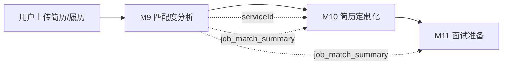
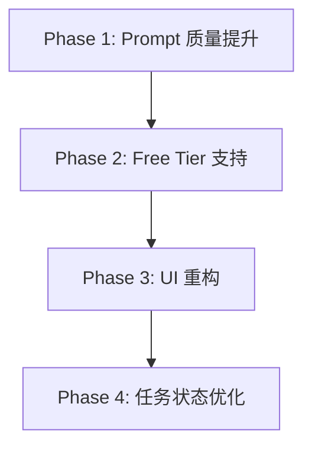
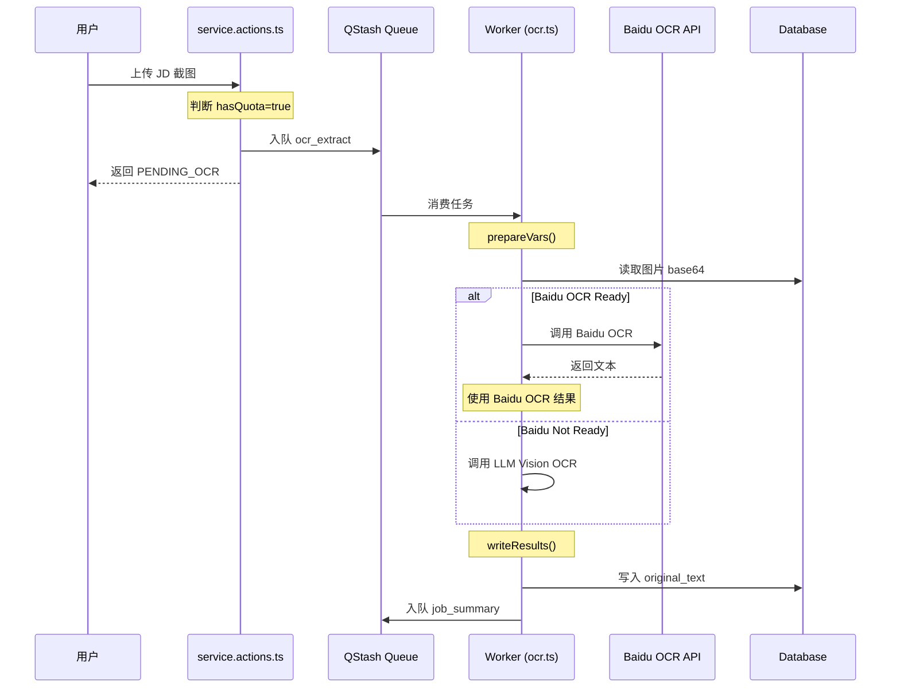

# M9 岗位匹配度分析 全链路重构方案

> **文档状态**: RFC (Request for Comments)  
> **最后更新**: 2025-01-06  
> **责任人**: AI IDE

---

## 一、背景与定位

### 1.1 M9 在产品链路中的角色

M9「岗位匹配度分析」是 CareerShaper 求职服务的**核心入口与承上启下关键节点**：



- **前置依赖**：用户需先完成简历/详历上传解析
- **核心产出**：
  - 创建唯一 `serviceId`，贯穿后续所有任务
  - 输出 `job_match_summary`，作为 M10/M11 的关键输入
  - 生成「敲门」私信话术，直接面向用户使用
- **执行链条**：OCR 识别（可选）→ JD 摘要提取 → 匹配度分析 → 结果呈现

### 1.2 现状评估

M9 经过初期开发与多轮小迭代后已"能用"，但与 M10 重构后的品质差距明显：

| 维度               | 当前状态   | 问题表现                                   |
| ------------------ | ---------- | ------------------------------------------ |
| **Prompt 质量**    | 及格线     | 缺乏深度行业洞察、CoT 不完整、话术机械化   |
| **Free Tier 支持** | 无         | 没有 `job_match_lite`，Free 用户体验受限   |
| **UI 质感**        | 可用但粗糙 | 颜色杂乱、信息层级不清、与 M10 风格不统一  |
| **任务进度体验**   | 不稳定     | 步骤串联卡顿、进度条无意义、流式吐字不连贯 |

### 1.3 重构目标

参照 M10 重构成功经验，将 M9 提升至同等品质基线：

1. **Prompt 2.0**：注入行业"隐性知识"，提升分析深度与话术转化率
2. **Free Tier 支持**：引入 `job_match_lite`，覆盖免费用户场景
3. **UI 质感统一**：与 M10 编辑器风格协调，打造专业感
4. **任务体验顺滑**：进度可预期、步骤流转顺畅、用户焦虑可控

---

## 二、问题深度诊断

### 2.1 Prompt 层面问题

参考 [docs/21.Prompt_Eng_job_match.md](file:///Users/edisonmbli/Projects/CareerShaper/docs/21.Prompt_Eng_job_match.md) 与 [docs/45.M10_Resume_Customize_Prompt_Optimize.md](file:///Users/edisonmbli/Projects/CareerShaper/docs/45.M10_Resume_Customize_Prompt_Optimize.md)：

| 问题               | 表现                                   | 根因               |
| ------------------ | -------------------------------------- | ------------------ |
| **JD 解析浅层化**  | 仅关键词匹配，忽略"硬指标"vs"废话"区分 | 缺乏 JD 解码逻辑   |
| **风险识别不足**   | 不识别"过度胜任"、"跳槽频繁"等隐性风险 | 缺乏 HR 视角思维链 |
| **话术机械化**     | H-V-C 结构生硬，缺乏"钩子策略"         | 未强制禁止废话开场 |
| **评估偏友善**     | 打分偏高，缺乏犀利反馈                 | 角色定位不清晰     |
| **第二人称不一致** | 有时用"候选人"而非"你"                 | 口吻指令不够明确   |

当前 Prompt（摘要）：

```typescript
// zh.ts L705-L777
systemPrompt: `你是一位拥有20年经验的**资深招聘专家和职业策略顾问**...`
userPrompt: `请基于以下材料进行专家级匹配度分析...`
```

**差距对比**：与 M10 的 `resume_customize` 相比，M9 的 Prompt 缺乏：

- 明确的"三层处理模型"（PRESERVE/REFINE/AUGMENT 在 M10 中表现优异）
- 结构化的思维链（Step 1-7）
- 输出格式的精确约束

### 2.2 UI/UX 层面问题

#### A. ResultCard 视觉问题

当前 [ResultCard.tsx](file:///Users/edisonmbli/Projects/CareerShaper/components/workbench/ResultCard.tsx) 设计存在以下问题：

| 问题                | 表现                                    | 影响           |
| ------------------- | --------------------------------------- | -------------- |
| **色彩过杂**        | 绿/黄/蓝等多色混用，缺乏主色调          | 视觉疲劳       |
| **信息层级不清**    | Expert Verdict 与 Highlights 权重不分明 | 用户抓不住重点 |
| **组件块边界模糊**  | 各 Section 视觉分隔弱                   | 阅读体验割裂   |
| **与 M10 风格断层** | M10 编辑器简洁克制，M9 花哨             | 全站质感不统一 |

参考用户上传截图：

- 第一张（M9 ResultCard）：灯光效果虽有创意，但整体"土气"
- 第二张（M10 Editor）：简洁专业的编辑界面

#### B. 任务状态管理问题

涉及组件：

- [ServiceDisplay.tsx](file:///Users/edisonmbli/Projects/CareerShaper/components/app/ServiceDisplay.tsx)
- [StepperProgress.tsx](file:///Users/edisonmbli/Projects/CareerShaper/components/workbench/StepperProgress.tsx)
- [StatusConsole.tsx](file:///Users/edisonmbli/Projects/CareerShaper/components/workbench/StatusConsole.tsx)
- [StreamPanel.tsx](file:///Users/edisonmbli/Projects/CareerShaper/components/workbench/StreamPanel.tsx)
- [BatchProgressPanel.tsx](file:///Users/edisonmbli/Projects/CareerShaper/components/workbench/BatchProgressPanel.tsx)

| 问题               | 表现                               | 用户感受     |
| ------------------ | ---------------------------------- | ------------ |
| **步骤串联不顺滑** | OCR→Summary→Match 切换时有视觉跳跃 | 焦虑、不可控 |
| **进度条无意义**   | 进度百分比与实际无关联             | 失去信任     |
| **流式输出问题**   | 文案重复、节奏不稳定、卡顿         | 体验粗糙     |
| **状态同步问题**   | SSE 与 store 状态偶有冲突          | 界面闪烁     |

---

## 三、重构策略

### 3.1 总体思路

参照 M10 成功模式：**分 Phase 迭代，每 Phase 有明确交付物和验收标准**



### 3.2 Phase 设计

#### Phase 1: Prompt 质量提升

**目标**：将 `job_match` Prompt 升级至与 `resume_customize` 同等深度

**核心改动**：

1. **角色升级**

   - Before: "资深招聘专家和职业策略顾问"
   - After: "**私人求职教练**"（更强调第二人称对话感）

2. **JD 解码思维链**

   ```
   Step 1: 识别硬指标（Deal Breakers）——学历、核心技能、行业年限
   Step 2: 识别核心痛点——这个岗位招进来究竟解决什么问题
   Step 3: 过滤"正确的废话"——笼统的沟通能力、抗压能力等
   ```

3. **风险识别增强**

   - 新增"过度胜任"(Over-qualified) 风险检测
   - 新增"跳槽频繁"风险提示
   - 新增"行业跨度大"风险评估

4. **话术革命**

   - 强制禁止废话开场："您好，我对贵司很感兴趣"
   - 引入钩子公式：**问题共鸣** + **价值证明** + **行动邀约**
   - 输出格式：保持 H/V/C 三段式结构（与现有 Schema 完全兼容）

5. **评分机制细化**
   - 85-100: 硬指标达标 + 核心痛点命中 + 稀缺人才
   - 60-84: 技能达标但缺行业经验 / 存在过度胜任风险
   - <60: 硬指标缺失（学历/核心技能）

> **Schema 兼容性说明**：现有 `jobMatchSchema` 使用 `{ H, V, C }` 结构，本次 Prompt 优化仅改善内容指导，**无需修改 Schema 或 ResultCard 渲染逻辑**

**参考样本**：[docs/llm_testing/match_summary.json](file:///Users/edisonmbli/Projects/CareerShaper/docs/llm_testing/match_summary.json)

**交付物**：

- 更新 `lib/prompts/zh.ts` 的 `job_match`
- 更新 `lib/prompts/en.ts` 的 `job_match`
- 输出质量对比测试报告

#### Phase 1.5: OCR、Free tier 架构重构

目前已完成的前置 setup 工作：

0）前期调研文档：docs/48.OCR_Gemini_Model_Research.md
1）百度 OCR 相关的参数 BAIDU_API_KEY、BAIDU_SECRET_KEY 已维护到.env.local，并已在百度 Console 把接口调通了
2）通用文字识别（高精度版）的 官方 API 文档，供参考查阅：https://cloud.baidu.com/doc/OCR/s/1k3h7y3db
3）Gemini 模型调用参数 GEMINI_API_KEY 已维护到.env.local
4）Gemini-3 模型用于图片理解的官方 API 文档，供参考查阅：https://ai.google.dev/gemini-api/docs/gemini-3#javascript、https://ai.google.dev/gemini-api/docs/image-understanding

##### 方案概述

**核心目标**：去除智谱模型依赖，构建稳定低成本的双通路架构

**双通路设计**：

| 通路     | OCR 任务                    | 文本任务               | 特点                 |
| -------- | --------------------------- | ---------------------- | -------------------- |
| **Paid** | 百度 OCR 高精度版（小模型） | DeepSeek-Chat/Reasoner | 低成本、稳定、高质量 |
| **Free** | Gemini-3-Flash（图片理解）  | Gemini-3-Flash         | 免费额度内零成本     |

**关键改动**：

1. **Paid tier OCR**：从 LLM 视觉模型切换为百度 OCR API

   - 同步调用，不再经过 QStash 队列
   - 需对上传图片进行压缩（满足 4MB 限制）
   - 输出纯文本写入 `jobs.original_text`

2. **Free tier 合并流程**：将 `ocr_extract` + `job_summary` 合并为 `job_vision_summary`

   - 单次 Gemini 多模态调用直接输出 JobSummary 结构
   - 减少一次 LLM 调用，降低延迟

3. **Free tier 全面切换至 Gemini-3-Flash**：

   - `job_summary`、`job_match`、`resume_customize`、`interview_prep` 均使用 Gemini

4. **Rate Limiting 增强**：
   - Free tier：每用户每天限制 50 次 Gemini 调用
   - Paid tier：维持现有逻辑（每 90 秒 15 次）

##### 实施文件清单

| 操作   | 文件                             | 说明                                              |
| ------ | -------------------------------- | ------------------------------------------------- |
| NEW    | `lib/services/baidu-ocr.ts`      | 百度 OCR API 封装（Token 管理 + 调用）            |
| NEW    | `lib/utils/image-compress.ts`    | 服务端图片压缩（sharp 库）                        |
| NEW    | `lib/llm/gemini-provider.ts`     | Gemini Provider（@google/generative-ai SDK）      |
| MODIFY | `lib/llm/providers.ts`           | 添加 GEMINI_3_FLASH ModelId 和 GeminiProvider     |
| MODIFY | `lib/llm/task-router.ts`         | 更新任务路由表（Paid OCR 走百度、Free 走 Gemini） |
| MODIFY | `lib/prompts/zh.ts`              | 添加 job_vision_summary 模板                      |
| MODIFY | `lib/prompts/en.ts`              | 添加 job_vision_summary 模板                      |
| MODIFY | `lib/worker/strategies/ocr.ts`   | 双通路 OCR 逻辑                                   |
| MODIFY | `lib/rateLimiter.ts`             | Daily rate limit for Free tier                    |
| MODIFY | `lib/actions/service.actions.ts` | 条件路由（Paid 直接调百度 / Free 入队 Gemini）    |

##### Paid tier 上传 JD 截图 的完整工作流



**核心代码位置**：

| 阶段      | 文件                 | 行号     | 说明                                 |
| --------- | -------------------- | -------- | ------------------------------------ |
| 入队 OCR  | `service.actions.ts` | L140-195 | 入队 `ocr_extract` 任务              |
| 获取图片  | `ocr.ts`             | L29-80   | `prepareVars()` 读取图片             |
| Baidu OCR | `ocr.ts`             | L83-139  | `isBaiduOcrReady()` 检查 + API 调用  |
| 写入结果  | `ocr.ts`             | L173-280 | `writeResults()` 优先使用 Baidu 结果 |
| OCR API   | `baidu-ocr.ts`       | 全文件   | Token 管理 + API 封装                |
| 图片压缩  | `image-compress.ts`  | 全文件   | 满足 4MB 限制                        |

**延迟估算**：

| 阶段               | 延迟      |
| ------------------ | --------- |
| 队列调度（QStash） | ~0.5-1s   |
| 读取图片 + 压缩    | ~0.2-0.5s |
| **Baidu OCR API**  | **~1-3s** |
| 写入 DB + 入队     | ~0.1-0.2s |
| **总计**           | **~2-5s** |

#### Phase 2: Enhanced Reasoning Pipeline (Bad Cop / Good Cop)

**目标**：利用 Gemini Flash 的低成本优势，为 Paid 用户引入 "Pre-Match Audit" 环节，构建 "Reviewer -> Coach" 的双重分析架构，显著提升分析深度。

**架构设计**：

```mermaid
flowchart LR
    A[Job Summary] --> B{Tier?}
    B -- Free --> C[Job Match (Standard)]
    B -- Paid --> D[Pre-Match Audit (Bad Cop)]
    D --> E[Job Match (Good Cop + Context)]

    style D fill:#ffcccc,stroke:#333,stroke-width:2px
    style E fill:#ccffcc,stroke:#333,stroke-width:2px
```

**核心改动**：

1.  **新增 `pre_match_audit` Prompt (The Bad Cop)**

    - **角色**：严苛的简历审核员 (Gatekeeper)。
    - **任务**：寻找 Risk (硬伤)、Gap (差距) 和 "Deal Breakers"。
    - **模型**：Gemini-3-Flash (Fast & Cheap)。
    - **Fallback**：若调用失败/超时，自动跳过，不阻断流程。

2.  **升级 `job_match` Prompt (The Good Cop)**

    - **输入增强**：增加 `pre_match_risks` 变量。
    - **逻辑增强**：如果存在 Risk Context，则针对性制定 "化解策略" (Counter-Strategy)；否则执行标准分析。
    - **Prompt 设计**：使用 Worker 预处理将 Risk 封装为 `risk_context_block`，Prompt 仅需包含 `{{risk_context_block}}` 占位符，确保 Free Tier (空值) 兼容。

3.  **任务流重构 (`SummaryStrategy`)**

    - 在 `job_summary` 完成后进行路由分叉：
      - **Paid**: 入队 `pre_match_audit` (Batch)。
      - **Free**: 入队 `job_match` (Stream)。
    - `pre_match_audit` Worker 完成后，携带结果入队 `job_match`。

4.  **前端体验联动**
    - 复用 `MATCH_PENDING` 状态。
    - 当检测到 `hasQuota=true` 且处于 Match 阶段初期时，UI 显示 "AI 审计员正在进行红队测试..." (通过 Stream 消息或子步骤状态实现)。

**关键问题解决方案**：

- **Fallback 机制**：`PreMatchStrategy` 捕获所有 LLM 异常，一旦失败，记录日志并直接入队 `job_match` (Risk = null)，确保服务高可用。
- **Prompt 兼容**：Worker 负责变量清洗。Free Tier 传入空字符串，Prompt 表现为标准模式；Paid Tier 传入审计报告，Prompt 激活 "深度咨询模式"。

**交付物**：

- 新增 `pre_match_audit` Prompt
- 更新 `job_match` Prompt
- 新增 `PreMatchStrategy` Worker
- 更新 `SummaryStrategy` 路由逻辑
- 验证 Fallback 与 Free Tier 兼容性

##### 核心方案梳理

###### 1. 流程控制：如何“无感”插入中间层？

不修改前端的状态枚举（避免复杂的数据库迁移和前端重构），而是采用 **“状态复用 + 路由分叉”** 的策略。

- **后端路由分叉** (`SummaryStrategy`)：
  - 在 `Job Summary` 任务完成时，检查用户是否付费 (`wasPaid`)。
  - **Paid 用户**：静默插入 `pre_match_audit` 任务。此时前端状态依然保持为 `MATCH_PENDING`。
  - **Free 用户**：直接进入 `job_match` 任务。
- **前端感知**：
  - 虽然数据库状态没变，但我们可以利用 Server-Sent Events (SSE) 推送更细粒度的进度消息。
  - 当 `pre_match_audit` 开始运行时，推送一条 `status: "AUDITING"` 的消息。前端收到后，可以将 loading 文案从 "等待匹配..." 动态切换为 "AI 审计员正在进行红队测试..."。这样既不改 DB 结构，又给了付费用户尊贵的感知。

###### 2. Prompt 兼容：如何一套 Prompt 跑通两种场景？

不需要维护两套 Prompt，而是采用 **“条件式注入”**。

- **Worker 预处理**：在 `job_match` 的 Worker 中，检查上一步是否传来了 `audit_result`。
  - 如果有（Paid），构造一段文本：`\n【前置风险审计报告】\n${audit_result}\n`。
  - 如果没有（Free/Fallback），构造空字符串 `""`。
- **Prompt 设计**：
  - 在 System Prompt 中加入指令：_"如果输入中包含【前置风险审计报告】，请针对报告中的风险点制定化解策略；否则，请自行进行全面分析。"_
  - 这样模型会根据上下文自动适应，空参数完全不影响模型表现。

###### 3. Fallback 机制：免费模型挂了怎么办？

这是保证服务 SLA 的关键。我们将采用 **“快速失败，优雅降级”** 策略。

- **超时控制**：给 `pre_match_audit` 设置严格的超时（例如 60s）。Gemini Flash 很快，如果 60s 没回来，说明网络或服务有问题。
- **异常捕获**：在 `PreMatchStrategy` 中包裹 `try-catch`。
  - 一旦发生 Timeout 或 API Error，立即记录日志（不报错给用户）。
  - **立即执行 B 计划**：直接入队 `job_match`，并将 `audit_result` 设为空。
- **用户体验**：用户只会感觉“这次分析好像没经过深度审计步骤，直接出结果了”，而不会遇到“任务失败”的红屏报错。

##### 改动点回溯

已完成 Phase 2 的核心代码落地，实现了 **"Enhanced Reasoning Pipeline" (Bad Cop / Good Cop)** 架构。

###### ✅ 代码变更清单

1.  **架构定义与类型系统**

    - `lib/prompts/types.ts` & `lib/worker/types.ts`: 定义了 `PreMatchAuditVars`，并更新 `JobMatchVars` 支持 `pre_match_risks` 注入。
    - `lib/llm/zod-schemas.ts`: 定义了 `pre_match_audit` 的输出 Schema（Risk List + Severity）。
    - `lib/llm/task-router.ts`: 配置了 `pre_match_audit` 路由（Paid Tier -> Gemini-3-Flash -> Paid Batch Queue）。

2.  **Prompt 工程**

    - `lib/prompts/zh.ts` & `en.ts`:
      - **新增** `pre_match_audit` (The Bad Cop): 扮演严苛的 Gatekeeper，专门寻找 Deal Breakers。
      - **升级** `job_match` (The Good Cop): 增加了 `pre_match_risks` 上下文槽位。

3.  **Worker 策略与流程控制**
    - **新增** `lib/worker/strategies/pre_match.ts`:
      - 实现了审计逻辑。
      - **前端联动**：通过 SSE 推送 `status: "audit_start"`，让前端可以展示 "AI 审计员正在进行红队测试..."。
      - **Fallback 机制**：无论 LLM 成功与否，`writeResults` 都会确保入队 `job_match`。如果失败，`pre_match_risks` 为空（降级为标准模式）。
    - **修改** `lib/worker/strategies/summary.ts`:
      - 在 `enqueueMatchTask` 中实现了 **路由分叉**。
      - **Paid**: `Job Summary` -> `Pre-Match Audit` -> `Job Match`。
      - **Free**: `Job Summary` -> `Job Match`。

#### Phase 3: UI 重构实现高质感 (Expert Design Review V2)

**目标-1**：将 ResultCard 提升至与 M10 编辑器同等质感，统一全站视觉体验，消除"割裂感"。
**目标-2**：在"专业报告"的基础上，注入设计细节与微交互，打造**"Crafted Professionalism" (精致的专业感)**，避免陷入"Plain Text"的枯燥，同时拒绝"Tailwind Default"的廉价感。

**设计原则 (Frontend Design Skill)**:

- **Unified**: 移除 M9 特有的"Magazine Style"（斜切渐变、Playfair 字体、装饰性图标），统一使用 M10 的 System Sans + Blue/Zinc 色系。
- **Clean**: 减少视觉噪音。ResultCard 应像一份专业的"体检报告"而非"营销海报"。
- **Functional**: 优先展示核心结论（Verdict），详情（Strengths/Weaknesses）按需展开，侧边栏不抢戏。

**设计哲学 (Design Philosophy - V2)**:

- **Sophisticated (不落俗套)**: 拒绝默认的 Tailwind 色板。引入 **"Tinted Neutrals"** (如 Slate/Mauve) 和 **"Semantic Gradients"** (微光渐变) 来打破沉闷。
- **Tactile (触感)**: 引入微弱的 **Noise Texture** (噪点纹理) 和 **Soft Shadows** (弥散阴影)，模拟高级纸质报告的质感，增加页面的"厚度"。
- **Structured (结构美学)**: 利用 **Grid Lines** (网格线) 和 **Mono Typography** (等宽字体) 营造精密仪表的视觉隐喻，提升数据的可信度。

**核心改动方案 (Refined V2)**:

1.  **Sidebar 降噪处理 (`SidebarHistory.tsx`)**

- **问题**：折叠状态下显示过多 icon，视觉干扰且无意义。
- **方案**：
  - 新增 `collapsedLimit` prop (默认 5)。
  - 折叠状态下仅显示最近 5 个服务 icon。
  - 底部增加 "..." 指示器或直接截断，保持侧边栏清爽。
- 交互上折叠降噪，视觉上使用更细腻的 hover 态（如 `bg-slate-100/50`）。
    - _(维持 V1 方案)_: 交互上折叠降噪，视觉上使用更细腻的 hover 态（如 `bg-slate-100/50`）。

2.  **ResultCard 深度重构 (`ResultCard.tsx`)**

    - **Global Container**:

      - 背景：使用极淡的 `bg-slate-50/50 dark:bg-slate-950/50` + **Subtle Noise Texture**。
      - 边框：双层边框设计（内层极细 solid，外层淡色 glow），营造"卡片悬浮感"。

    - **Module A: The "Hero" Header (`ResultHeader.tsx`)**

      - **布局**：左右分栏。左侧 Job Meta，右侧 Score Hero。
      - **Job Meta**:
        - Company Name 使用 **Serif Font** (如 `font-serif` 搭配自定义 CSS 字体栈) 增加人文感，与 Job Title 的 Sans-serif 形成对比。
        - 增加 "Match Date" 的 Mono 字体显示。
      - **Score Hero**:
        - **Radial Progress**: 舍弃纯数字。使用 SVG 环形进度条，带有 **Gradient Stroke** (Teal -> Emerald)。
        - **Glow Effect**: 进度条下方增加一层同色系的弥散光晕。

    - **Module B: The "Insight" Block (`ExpertVerdict.tsx`)**

      - **视觉容器**：**Glassmorphism** (毛玻璃) 风格。`bg-white/60 backdrop-blur-md border-white/20`。
      - **装饰元素**：背景叠加淡淡的 **Dot Pattern** (点阵图案) 或 **Grid Lines**。
      - **排版**：首字下沉 (Drop Cap) 或引用符号的大号水印，增强"专家手写"的暗示。

    - **Module C: Analysis Accordions (`AnalysisAccordion.tsx`)**

      - **交互**：Hover 时整行微弱上浮 (`translate-x-1`)，Indicator 图标旋转。
      - **Typography**:
        - Heading: `font-medium tracking-tight text-slate-900`。
        - Count Badge: 使用 `bg-slate-100 text-slate-600 font-mono text-[10px]`。
      - **Content**:
        - Markdown 渲染。
        - List Item：自定义 Bullet Point (如实心小方块 ▪️)，而非默认圆点。
        - Strong Text：使用 `font-semibold text-indigo-600` (Highlight 色) 进行强调。

    - **Module D: Smart Pitch Simulator (`SmartPitch.tsx`)**
      - **Tab 设计**：**[ Preview ]** / **[ Source ]** 使用 "Segmented Control" 样式（胶囊切换）。
      - **Preview Mode (The Simulator)**:
        - 不仅仅是文本，而是 **模拟真实场景**。
        - 外框模拟 "LinkedIn Message" 或 "Email Client" 的 UI (带有 Avatar 占位符、发送按钮占位符)。
        - 让用户感觉到："这就是我发出去之后的样子"。
      - **Tags**: Hook/Value/CTA 使用 **Outline Badge** 风格 (`border border-blue-200 text-blue-600 bg-blue-50/50`)，更显轻盈。

**UI 细节打磨清单 (High ROI Details)**:

- [ ] **Custom Scrollbar**: 隐藏默认滚动条，使用极细的自定义滚动条。
- [ ] **Selection Color**: 全局文本选中色改为 Brand Color (Indigo/Teal) 的半透明色。
- [ ] **Loading State**: 使用 **Shimmer Effect** (流光骨架屏) 替代简单的 Spinner。
- [ ] **Copy Feedback**: 复制成功时触发微小的 **Confetti** (纸屑) 动画或 Checkmark 变形动画。

**移动端适配策略 (Mobile Adaptation Strategy)**:
(详见上文历史记录)

#### Phase 3: UI 重构实现高质感 (Expert Design Review V3 - The "Editorial" Polish)

**用户反馈 (User Feedback)**:

1.  **Visual Disconnect**: Header/Verdict 设计感强，但 Accordion 断层，像是 Tailwind 默认样式拼凑。
2.  **Tips Styling**: "Interview Prep" / "Resume Tweak" 的色块背景显得廉价，双列排布缺乏设计感。
3.  **SmartPitch Clutter**: 模拟窗口过于杂乱（OS Header、Tab），且与整体风格不融合。
4.  **Typography**: 字体选择和层级显得不够专业，缺乏统筹。
2.  **Too Many Colors**: 页面颜色过多（绿/红/黄/蓝等），不够专业文档化。希望能减少颜色使用，探索更优雅的单色/双色表达方式。


- **Editorial Consistency**: 将 Header 的 "Serif (衬线体)" 基因延续到 Accordion 标题，贯穿全文。
- **Elegant Tips**: 摒弃廉价色块。采用 **"Architectural" (建筑感)** 的线条与留白来展示建议。
- **De-cluttered Pitch**: 极简模拟。移除 OS 窗口装饰，仅保留对话气泡核心，强调内容的"真实感"。
- **Typography System**: 建立严谨的字体层级，混合使用 Serif/Sans/Mono，打造杂志级排版。
- **Monochromatic Aesthetic**: 移除功能性色块（红绿灯色），改用 **形状 (Shape)**、**排版 (Typography)** 和 **灰度 (Grayscale)** 来区分信息层级。
**核心改动方案 (Refined V3)**:

1.  **AnalysisAccordion 深度打磨**

    - **Typography**: Section Title 改用 **Serif Font**，与 ResultHeader 呼应，强化"杂志/报告"的阅读流。
    - **Connector**: 优化左侧连接线，使用更细的线条 + **Hollow Dot (空心圆点)**，增加呼吸感。
    - **Tips Redesign**:
      - **移除**：`bg-blue-50/bg-amber-50` 背景色。
      - **采用**：**Left Border Accent (左侧强调线)** + **Clean Padding**。
      - **Layout**: 保持双列（桌面端），但去除边框容器感，让文字直接流淌，通过 Icon 和 Label 区分。
      - **Icon**: 使用更轻量的 Icon (stroke-width 1.5)，颜色保持语义化但降低饱和度。

2.  **SmartPitch 极简模拟**

    - **Remove Chrome**: 移除模拟窗口顶部的 "Traffic Lights" (红黄绿点) 和 Header Bar。
    - **Tabs -> Toggle**: 将显眼的 Tabs 替换为右上角极小的 **"Eye / Code"** 图标切换，减少视觉噪音。
    - **Bubble Only**: 仅展示"头像 + 气泡"，背景融入 ResultCard 的纹理，不再显得突兀。
    - **Source Mode**: 源码模式改为 **"Drawer" (抽屉)** 或简单的文本框，不再占据过多注意力。

3.  **Visual Rhythm (视觉韵律)**

    - 调整各模块间的间距，确保 Header -> Verdict -> Accordion -> Pitch 的阅读视线流畅。

4.  **Typography System (The Professional Voice)**
    - **Font Stack Strategy**:
      - **Serif (衬线体)**: 用于 `Company Name`, `Expert Verdict Body`, `Section Titles (Highlights/Risks)`. 传递"人文、权威、杂志"感。
      - **Sans (无衬线体)**: 用于 `UI Elements`, `Job Title`, `Body Text (Points)`, `Buttons`. 传递"现代、清晰、效率"。
      - **Mono (等宽字体)**: 用于 `Data Points`, `Dates`, `Badges`, `Count Indicators`. 传递"数据、精确、科技"。
    - **Type Scale & Weight**:
      - **Hierarchy**: H1 (Serif) > H2 (Serif) > Body (Sans) > Meta (Mono).
      - **Weight**: 减少 `font-bold` 的使用，更多使用 `font-medium` (500) 和 `font-semibold` (600) 以保持精致感。
      - **Leading**: 增加正文行高 (`leading-relaxed` -> `leading-7` or `leading-loose`)，提升长文阅读的呼吸感。
      - Tips: 纯文字标签 (No colored background/border)。
**交付物清单 (Updated)**:

- [ ] `components/workbench/result/AnalysisAccordion.tsx` (Serif Title, Elegant Tips)
- [ ] `components/workbench/result/SmartPitch.tsx` (No Chrome, Icon Toggle)
- [ ] `components/workbench/ResultCard.tsx` (Final Polish)
    - Typographic Badges: 移除彩色胶囊，改用 **[HOOK]** (Serif Bold), **[VALUE]** (Italic), **[CTA]** (Small Caps) 的纯文字/边框样式。

**Deliverables**:

- 完全去色化的 "Professional Report" 风格组件库。
- 极致紧凑的信息密度。

**移动端适配策略 (Mobile Adaptation Strategy)**:

在小屏设备上，我们需要在"精致感"与"信息密度"之间取得新的平衡，避免过度装饰导致的视觉拥挤。

1.  **Layout Reset (布局重置)**

    - **ResultHeader**: 从 "左右分栏" 切换为 **"垂直堆叠"**。
      - Top: Job Meta (居中对齐，Serif 字体适当缩小)。
      - Bottom: Score Hero (缩放至 0.8x，保留 Glow Effect，但减少周围留白)。
    - **Global Padding**: 将桌面端的 `p-6/p-8` 调整为更紧凑的 `p-4`，最大化内容展示区。

2.  **Simplification (视觉简化)**

    - **Texture & Glassmorphism**: 在移动端适当 **减弱** 噪点纹理和毛玻璃模糊度 (Performance & Battery consideration)，改用高透明度的纯色叠加，保持视觉通透但降低渲染开销。
    - **Smart Pitch Simulator**:
      - 桌面端：完整模拟 Email/LinkedIn 窗口（带 Avatar、Sidebar）。
      - 移动端：**"Chat Bubble" 模式**。仅保留核心的气泡对话框样式，去除模拟的窗口外框，让内容直接占据屏幕宽度，提升阅读体验。

3.  **Touch Experience (触控优化)**
    - **AnalysisAccordion**: 移除 Hover 上浮效果。增加点击区域高度 (min-height: 48px)。
    - **Tabs**: Smart Pitch 的 Tabs 切换改为全宽 (Full Width) 的 Segmented Control，方便拇指操作。
    - **Typography**: 增大正文行高 (Leading-loose)，防止误触并提升阅读舒适度。

**交付物清单**:

- [ ] `components/workbench/ResultCard.tsx` (Container & Layout)
- [ ] `components/workbench/result/ResultHeader.tsx` (Radial Score & Serif Meta)
- [ ] `components/workbench/result/ExpertVerdict.tsx` (Glassmorphism & Texture)
- [ ] `components/workbench/result/AnalysisAccordion.tsx` (Micro-interactions)
- [ ] `components/workbench/result/SmartPitch.tsx` (UI Simulator)
- [ ] `components/workbench/SidebarHistory.tsx` (Refined)

#### Phase 4: 任务状态管理优化

**目标**：实现顺滑的多步骤任务体验

**核心改动**：

1. **步骤可视化增强**

   - 在 StepperProgress 中显示子步骤（OCR → Summary → Match）
   - 当前步骤高亮 + 脉冲动画
   - 已完成步骤显示 ✓

2. **进度条语义化 + 时间模拟**

   参考 M10 的 [workbench-stage.ts](file:///Users/edisonmbli/Projects/CareerShaper/lib/utils/workbench-stage.ts#L324-L340) 实现，为 M9 各阶段引入时间模拟进度：

   | 阶段    | 进度范围 | 预估时长 | 更新频率 |
   | ------- | -------- | -------- | -------- |
   | OCR     | 0-30%    | 60s      | 每 3s    |
   | Summary | 30-50%   | 60s      | 每 3s    |
   | Match   | 50-100%  | 120s     | 每 3s    |

   **模拟逻辑**：

   ```
   进入 xxx_PENDING 状态 → 启动定时器 (startedAt = now)
   每 3s: progress = 阶段起点 + (elapsed / 预估时长) * 阶段跨度 → 最高阶段封顶值的95%
   收到 xxx_COMPLETED → 立即跳到阶段封顶值
   ```

3. **StreamPanel 优化**

   - 修复文案重复问题
   - 平滑打字机效果（requestAnimationFrame 节流）
   - 添加"跳过动画"选项

4. **状态同步加固**
   - 确保 SSE 事件与 store 状态一致
   - 添加状态过渡动画（fade in/out）
   - 防止界面闪烁

**交付物**：

- 优化后的状态管理组件
- 进度时间模拟配置（扩展 `workbench-stage.ts`）
- 用户体验对比视频/GIF

---

## 四、执行计划

### Phase 1: Prompt 质量提升

- [ ] 分析当前 Prompt 输出样本，记录问题
- [ ] 设计新版 Prompt（System + User）
- [ ] 实现 zh.ts 更新
- [ ] 实现 en.ts 更新
- [ ] 本地测试验证
- [ ] 输出质量对比报告

### Phase 2: Free Tier 支持

- [ ] 设计 job_match_lite Prompt
- [ ] 添加类型定义
- [ ] 实现 Prompt（zh + en）
- [ ] 更新 Task Router
- [ ] 更新 Zod Schema 映射
- [ ] Free 路径 E2E 测试

### Phase 3: UI 重构

- [ ] 审计当前 ResultCard 问题清单
- [ ] 设计新版视觉规范
- [ ] 重构 ResultCard 组件
- [ ] 统一色彩/间距 Token
- [ ] 响应式适配验证
- [ ] Before/After 截图对比

### Phase 4: 任务状态优化

- [ ] 审计当前状态管理问题
- [ ] 设计进度语义化映射
- [ ] 优化 StepperProgress 子步骤显示
- [ ] 修复 StreamPanel 打字机问题
- [ ] 加固状态同步逻辑
- [ ] 用户体验对比演示

---

## 五、验收标准

### Phase 1 验收

- [ ] 新 Prompt 输出包含"过度胜任"风险识别
- [ ] 话术无废话开场（验证禁止词过滤）
- [ ] 评分分布合理（不再普遍偏高）
- [ ] 第二人称"你"一致使用

### Phase 2 验收

- [ ] Free 用户可正常触发 job_match_lite
- [ ] 输出结构与 Standard 版兼容
- [ ] GLM Flash 执行无超时

### Phase 3 验收

- [ ] ResultCard 色彩与 M10 编辑器风格统一
- [ ] 信息层级清晰，一眼抓住重点
- [ ] 移动端适配无溢出

### Phase 4 验收

- [ ] 进度条百分比与实际步骤相关联
- [ ] 步骤切换无视觉跳跃
- [ ] 流式输出无文案重复
- [ ] 整体任务执行"感觉顺滑"

---

## 六、风险与回滚

| 风险                         | 缓解措施                   |
| ---------------------------- | -------------------------- |
| 新 Prompt 导致输出格式不稳定 | 保留旧版 Prompt 作为回滚点 |
| UI 重构影响既有功能          | 分支开发，灰度验证         |
| 状态管理改动引入 regression  | 增加关键路径 E2E 测试      |

---

## 附录：参考文件

### 历史文档

- [docs/16.Execution_Details_M9.md](file:///Users/edisonmbli/Projects/CareerShaper/docs/16.Execution_Details_M9.md)
- [docs/19.Workbench_UI_Revamp_Drafts.md](file:///Users/edisonmbli/Projects/CareerShaper/docs/19.Workbench_UI_Revamp_Drafts.md)
- [docs/20.Workbench_UI_Revamp_Details.md](file:///Users/edisonmbli/Projects/CareerShaper/docs/20.Workbench_UI_Revamp_Details.md)
- [docs/21.Prompt_Eng_job_match.md](file:///Users/edisonmbli/Projects/CareerShaper/docs/21.Prompt_Eng_job_match.md)
- [docs/45.M10_Resume_Customize_Prompt_Optimize.md](file:///Users/edisonmbli/Projects/CareerShaper/docs/45.M10_Resume_Customize_Prompt_Optimize.md)

### 核心代码

- [lib/prompts/zh.ts](file:///Users/edisonmbli/Projects/CareerShaper/lib/prompts/zh.ts) - Prompt 定义
- [lib/prompts/en.ts](file:///Users/edisonmbli/Projects/CareerShaper/lib/prompts/en.ts) - 英文 Prompt
- [components/workbench/ResultCard.tsx](file:///Users/edisonmbli/Projects/CareerShaper/components/workbench/ResultCard.tsx) - 结果卡片
- [components/app/ServiceDisplay.tsx](file:///Users/edisonmbli/Projects/CareerShaper/components/app/ServiceDisplay.tsx) - 服务主容器
- [components/workbench/StepperProgress.tsx](file:///Users/edisonmbli/Projects/CareerShaper/components/workbench/StepperProgress.tsx) - 步骤导航
- [components/workbench/StatusConsole.tsx](file:///Users/edisonmbli/Projects/CareerShaper/components/workbench/StatusConsole.tsx) - 状态控制台
- [components/workbench/StreamPanel.tsx](file:///Users/edisonmbli/Projects/CareerShaper/components/workbench/StreamPanel.tsx) - 流式面板

### 截图参考

- M9 当前效果：
- M10 目标风格：
