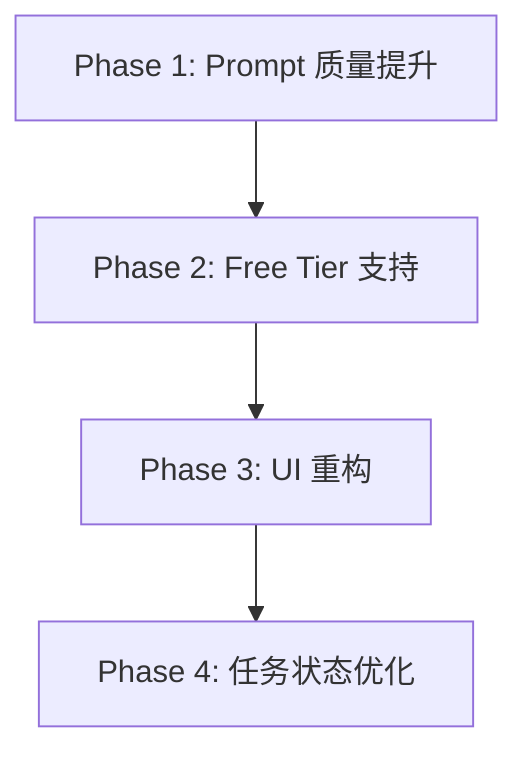

# M9 岗位匹配度分析 全链路重构方案

> **文档状态**: RFC (Request for Comments)  
> **最后更新**: 2025-01-06  
> **责任人**: AI IDE

---

## 一、背景与定位

### 1.1 M9 在产品链路中的角色

M9「岗位匹配度分析」是 CareerShaper 求职服务的**核心入口与承上启下关键节点**：


- **前置依赖**：用户需先完成简历/详历上传解析
- **核心产出**：
  - 创建唯一 `serviceId`，贯穿后续所有任务
  - 输出 `job_match_summary`，作为 M10/M11 的关键输入
  - 生成「敲门」私信话术，直接面向用户使用
- **执行链条**：OCR识别（可选）→ JD摘要提取 → 匹配度分析 → 结果呈现

### 1.2 现状评估

M9 经过初期开发与多轮小迭代后已"能用"，但与 M10 重构后的品质差距明显：

| 维度 | 当前状态 | 问题表现 |
|---|---|---|
| **Prompt 质量** | 及格线 | 缺乏深度行业洞察、CoT不完整、话术机械化 |
| **Free Tier 支持** | 无 | 没有 `job_match_lite`，Free 用户体验受限 |
| **UI 质感** | 可用但粗糙 | 颜色杂乱、信息层级不清、与 M10 风格不统一 |
| **任务进度体验** | 不稳定 | 步骤串联卡顿、进度条无意义、流式吐字不连贯 |

### 1.3 重构目标

参照 M10 重构成功经验，将 M9 提升至同等品质基线：

1. **Prompt 2.0**：注入行业"隐性知识"，提升分析深度与话术转化率
2. **Free Tier 支持**：引入 `job_match_lite`，覆盖免费用户场景
3. **UI 质感统一**：与 M10 编辑器风格协调，打造专业感
4. **任务体验顺滑**：进度可预期、步骤流转顺畅、用户焦虑可控

---

## 二、问题深度诊断

### 2.1 Prompt 层面问题

参考 [docs/21.Prompt_Eng_job_match.md](file:///Users/edisonmbli/Projects/CareerShaper/docs/21.Prompt_Eng_job_match.md) 与 [docs/45.M10_Resume_Customize_Prompt_Optimize.md](file:///Users/edisonmbli/Projects/CareerShaper/docs/45.M10_Resume_Customize_Prompt_Optimize.md)：

| 问题 | 表现 | 根因 |
|---|---|---|
| **JD 解析浅层化** | 仅关键词匹配，忽略"硬指标"vs"废话"区分 | 缺乏 JD 解码逻辑 |
| **风险识别不足** | 不识别"过度胜任"、"跳槽频繁"等隐性风险 | 缺乏 HR 视角思维链 |
| **话术机械化** | H-V-C 结构生硬，缺乏"钩子策略" | 未强制禁止废话开场 |
| **评估偏友善** | 打分偏高，缺乏犀利反馈 | 角色定位不清晰 |
| **第二人称不一致** | 有时用"候选人"而非"你" | 口吻指令不够明确 |

当前 Prompt（摘要）：
```typescript
// zh.ts L705-L777
systemPrompt: `你是一位拥有20年经验的**资深招聘专家和职业策略顾问**...`
userPrompt: `请基于以下材料进行专家级匹配度分析...`
```

**差距对比**：与 M10 的 `resume_customize` 相比，M9 的 Prompt 缺乏：
- 明确的"三层处理模型"（PRESERVE/REFINE/AUGMENT 在 M10 中表现优异）
- 结构化的思维链（Step 1-7）
- 输出格式的精确约束

### 2.2 UI/UX 层面问题

#### A. ResultCard 视觉问题

当前 [ResultCard.tsx](file:///Users/edisonmbli/Projects/CareerShaper/components/workbench/ResultCard.tsx) 设计存在以下问题：

| 问题 | 表现 | 影响 |
|---|---|---|
| **色彩过杂** | 绿/黄/蓝等多色混用，缺乏主色调 | 视觉疲劳 |
| **信息层级不清** | Expert Verdict 与 Highlights 权重不分明 | 用户抓不住重点 |
| **组件块边界模糊** | 各 Section 视觉分隔弱 | 阅读体验割裂 |
| **与 M10 风格断层** | M10 编辑器简洁克制，M9 花哨 | 全站质感不统一 |

参考用户上传截图：
- 第一张（M9 ResultCard）：灯光效果虽有创意，但整体"土气"
- 第二张（M10 Editor）：简洁专业的编辑界面

#### B. 任务状态管理问题

涉及组件：
- [ServiceDisplay.tsx](file:///Users/edisonmbli/Projects/CareerShaper/components/app/ServiceDisplay.tsx)
- [StepperProgress.tsx](file:///Users/edisonmbli/Projects/CareerShaper/components/workbench/StepperProgress.tsx)
- [StatusConsole.tsx](file:///Users/edisonmbli/Projects/CareerShaper/components/workbench/StatusConsole.tsx)
- [StreamPanel.tsx](file:///Users/edisonmbli/Projects/CareerShaper/components/workbench/StreamPanel.tsx)
- [BatchProgressPanel.tsx](file:///Users/edisonmbli/Projects/CareerShaper/components/workbench/BatchProgressPanel.tsx)

| 问题 | 表现 | 用户感受 |
|---|---|---|
| **步骤串联不顺滑** | OCR→Summary→Match 切换时有视觉跳跃 | 焦虑、不可控 |
| **进度条无意义** | 进度百分比与实际无关联 | 失去信任 |
| **流式输出问题** | 文案重复、节奏不稳定、卡顿 | 体验粗糙 |
| **状态同步问题** | SSE 与 store 状态偶有冲突 | 界面闪烁 |

---

## 三、重构策略

### 3.1 总体思路

参照 M10 成功模式：**分 Phase 迭代，每 Phase 有明确交付物和验收标准**



### 3.2 Phase 设计

#### Phase 1: Prompt 质量提升

**目标**：将 `job_match` Prompt 升级至与 `resume_customize` 同等深度

**核心改动**：

1. **角色升级**
   - Before: "资深招聘专家和职业策略顾问"
   - After: "**私人求职教练**"（更强调第二人称对话感）

2. **JD 解码思维链**
   ```
   Step 1: 识别硬指标（Deal Breakers）——学历、核心技能、行业年限
   Step 2: 识别核心痛点——这个岗位招进来究竟解决什么问题
   Step 3: 过滤"正确的废话"——笼统的沟通能力、抗压能力等
   ```

3. **风险识别增强**
   - 新增"过度胜任"(Over-qualified) 风险检测
   - 新增"跳槽频繁"风险提示
   - 新增"行业跨度大"风险评估

4. **话术革命**
   - 强制禁止废话开场："您好，我对贵司很感兴趣"
   - 引入钩子公式：**问题共鸣** + **价值证明** + **行动邀约**
   - 输出格式：保持 H/V/C 三段式结构（与现有 Schema 完全兼容）

5. **评分机制细化**
   - 85-100: 硬指标达标 + 核心痛点命中 + 稀缺人才
   - 60-84: 技能达标但缺行业经验 / 存在过度胜任风险
   - <60: 硬指标缺失（学历/核心技能）

> **Schema 兼容性说明**：现有 `jobMatchSchema` 使用 `{ H, V, C }` 结构，本次 Prompt 优化仅改善内容指导，**无需修改 Schema 或 ResultCard 渲染逻辑**

**参考样本**：[docs/llm_testing/match_summary.json](file:///Users/edisonmbli/Projects/CareerShaper/docs/llm_testing/match_summary.json)

**交付物**：
- 更新 `lib/prompts/zh.ts` 的 `job_match`
- 更新 `lib/prompts/en.ts` 的 `job_match`
- 输出质量对比测试报告

#### Phase 2: 引入 job_match_lite for Free Tier

**目标**：为免费用户提供基础版匹配分析

**核心改动**：

1. **新增 Prompt**
   - `job_match_lite`：精简版，适配 GLM Flash
   - 移除复杂 CoT，保留核心分析逻辑
   - 简化输出结构

2. **路由配置**
   - 在 `task-router.ts` 添加 Free 路径映射
   - 在 `zod-schemas.ts` 添加 Schema 映射

3. **类型扩展**
   - 在 `types.ts` 添加类型定义

**交付物**：
- 新增 `job_match_lite` Prompt（zh + en）
- 更新 Task Router 配置
- Free 路径测试验证

#### Phase 3: UI 重构实现高质感

**目标**：将 ResultCard 提升至与 M10 编辑器同等质感

**核心改动**：

1. **色彩体系统一**
   - 主色调：蓝色系（与 M10 一致）
   - 强调色：翡翠绿（高分）、琥珀色（中分）、珊瑚红（低分）
   - 移除过多渐变，采用扁平化设计

2. **信息层级重构**
   ```
   ┌─────────────────────────────────────┐
   │ Score Badge + Company/Job          │ ← 顶部固定
   ├─────────────────────────────────────┤
   │ Expert Verdict                     │ ← 核心结论，突出显示
   ├─────────────────────────────────────┤
   │ Strengths (折叠)                   │ ← 可展开详情
   ├─────────────────────────────────────┤
   │ Weaknesses (折叠)                  │ ← 可展开详情
   ├─────────────────────────────────────┤
   │ Smart Pitch                        │ ← 话术区，一键复制
   └─────────────────────────────────────┘
   ```

3. **组件样式优化**
   - 移除 LampDesk 装饰（与 M10 风格冲突）
   - 采用 subtle border 替代 gradient 背景
   - 统一 Timeline 样式（点+线）

4. **交互增强**
   - Highlights/Weaknesses 默认折叠，点击展开
   - Smart Pitch 增加"预览模式"与"复制模式"切换
   - 添加"查看原始 JSON"调试入口（仅 dev 环境）

**交付物**：
- 重构后的 `ResultCard.tsx`
- 统一的色彩/间距 Token 文档
- 视觉对比 Before/After 截图

#### Phase 4: 任务状态管理优化

**目标**：实现顺滑的多步骤任务体验

**核心改动**：

1. **步骤可视化增强**
   - 在 StepperProgress 中显示子步骤（OCR → Summary → Match）
   - 当前步骤高亮 + 脉冲动画
   - 已完成步骤显示 ✓

2. **进度条语义化 + 时间模拟**

   参考 M10 的 [workbench-stage.ts](file:///Users/edisonmbli/Projects/CareerShaper/lib/utils/workbench-stage.ts#L324-L340) 实现，为 M9 各阶段引入时间模拟进度：

   | 阶段 | 进度范围 | 预估时长 | 更新频率 |
   |---|---|---|---|
   | OCR | 0-30% | 60s | 每3s |
   | Summary | 30-50% | 60s | 每3s |
   | Match | 50-100% | 120s | 每3s |

   **模拟逻辑**：
   ```
   进入 xxx_PENDING 状态 → 启动定时器 (startedAt = now)
   每 3s: progress = 阶段起点 + (elapsed / 预估时长) * 阶段跨度 → 最高阶段封顶值的95%
   收到 xxx_COMPLETED → 立即跳到阶段封顶值
   ```

3. **StreamPanel 优化**
   - 修复文案重复问题
   - 平滑打字机效果（requestAnimationFrame 节流）
   - 添加"跳过动画"选项

4. **状态同步加固**
   - 确保 SSE 事件与 store 状态一致
   - 添加状态过渡动画（fade in/out）
   - 防止界面闪烁

**交付物**：
- 优化后的状态管理组件
- 进度时间模拟配置（扩展 `workbench-stage.ts`）
- 用户体验对比视频/GIF

---

## 四、执行计划

### Phase 1: Prompt 质量提升

- [ ] 分析当前 Prompt 输出样本，记录问题
- [ ] 设计新版 Prompt（System + User）
- [ ] 实现 zh.ts 更新
- [ ] 实现 en.ts 更新
- [ ] 本地测试验证
- [ ] 输出质量对比报告

### Phase 2: Free Tier 支持

- [ ] 设计 job_match_lite Prompt
- [ ] 添加类型定义
- [ ] 实现 Prompt（zh + en）
- [ ] 更新 Task Router
- [ ] 更新 Zod Schema 映射
- [ ] Free 路径 E2E 测试

### Phase 3: UI 重构

- [ ] 审计当前 ResultCard 问题清单
- [ ] 设计新版视觉规范
- [ ] 重构 ResultCard 组件
- [ ] 统一色彩/间距 Token
- [ ] 响应式适配验证
- [ ] Before/After 截图对比

### Phase 4: 任务状态优化

- [ ] 审计当前状态管理问题
- [ ] 设计进度语义化映射
- [ ] 优化 StepperProgress 子步骤显示
- [ ] 修复 StreamPanel 打字机问题
- [ ] 加固状态同步逻辑
- [ ] 用户体验对比演示

---

## 五、验收标准

### Phase 1 验收

- [ ] 新 Prompt 输出包含"过度胜任"风险识别
- [ ] 话术无废话开场（验证禁止词过滤）
- [ ] 评分分布合理（不再普遍偏高）
- [ ] 第二人称"你"一致使用

### Phase 2 验收

- [ ] Free 用户可正常触发 job_match_lite
- [ ] 输出结构与 Standard 版兼容
- [ ] GLM Flash 执行无超时

### Phase 3 验收

- [ ] ResultCard 色彩与 M10 编辑器风格统一
- [ ] 信息层级清晰，一眼抓住重点
- [ ] 移动端适配无溢出

### Phase 4 验收

- [ ] 进度条百分比与实际步骤相关联
- [ ] 步骤切换无视觉跳跃
- [ ] 流式输出无文案重复
- [ ] 整体任务执行"感觉顺滑"

---

## 六、风险与回滚

| 风险 | 缓解措施 |
|---|---|
| 新 Prompt 导致输出格式不稳定 | 保留旧版 Prompt 作为回滚点 |
| UI 重构影响既有功能 | 分支开发，灰度验证 |
| 状态管理改动引入 regression | 增加关键路径 E2E 测试 |

---

## 附录：参考文件

### 历史文档
- [docs/16.Execution_Details_M9.md](file:///Users/edisonmbli/Projects/CareerShaper/docs/16.Execution_Details_M9.md)
- [docs/19.Workbench_UI_Revamp_Drafts.md](file:///Users/edisonmbli/Projects/CareerShaper/docs/19.Workbench_UI_Revamp_Drafts.md)
- [docs/20.Workbench_UI_Revamp_Details.md](file:///Users/edisonmbli/Projects/CareerShaper/docs/20.Workbench_UI_Revamp_Details.md)
- [docs/21.Prompt_Eng_job_match.md](file:///Users/edisonmbli/Projects/CareerShaper/docs/21.Prompt_Eng_job_match.md)
- [docs/45.M10_Resume_Customize_Prompt_Optimize.md](file:///Users/edisonmbli/Projects/CareerShaper/docs/45.M10_Resume_Customize_Prompt_Optimize.md)

### 核心代码
- [lib/prompts/zh.ts](file:///Users/edisonmbli/Projects/CareerShaper/lib/prompts/zh.ts) - Prompt 定义
- [lib/prompts/en.ts](file:///Users/edisonmbli/Projects/CareerShaper/lib/prompts/en.ts) - 英文 Prompt
- [components/workbench/ResultCard.tsx](file:///Users/edisonmbli/Projects/CareerShaper/components/workbench/ResultCard.tsx) - 结果卡片
- [components/app/ServiceDisplay.tsx](file:///Users/edisonmbli/Projects/CareerShaper/components/app/ServiceDisplay.tsx) - 服务主容器
- [components/workbench/StepperProgress.tsx](file:///Users/edisonmbli/Projects/CareerShaper/components/workbench/StepperProgress.tsx) - 步骤导航
- [components/workbench/StatusConsole.tsx](file:///Users/edisonmbli/Projects/CareerShaper/components/workbench/StatusConsole.tsx) - 状态控制台
- [components/workbench/StreamPanel.tsx](file:///Users/edisonmbli/Projects/CareerShaper/components/workbench/StreamPanel.tsx) - 流式面板

### 截图参考
- M9 当前效果：
- M10 目标风格：
