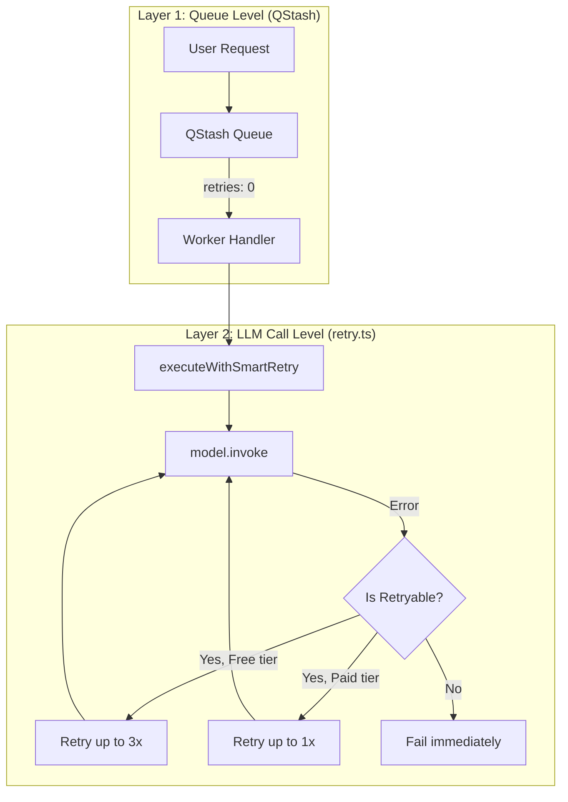

# Smart Retry Mechanism Walkthrough

## Overview

This document explains the new tier-aware smart retry mechanism implemented for LLM operations. It clarifies the relationship with QStash and details how the retry logic works across different files.

---

## Architecture: Two-Layer Retry Model



---

## QStash vs In-Process Retry

### 为什么关闭 QStash 重试？

传统应用确实会把重试交给消息队列（如 QStash）处理。但这种方式有两个问题：

| 问题 | 说明 |
|------|------|
| **Token 浪费** | 如果 LLM 调用失败是 JSON 解析错误（非瞬态），QStash 会不断重试，每次都消耗 tokens |
| **无差异化** | QStash 无法区分 Free/Paid tier，无法应用不同的重试策略 |

### 当前设计

| 层级 | 位置 | 重试次数 | 职责 |
|------|------|----------|------|
| **QStash** | [producer.ts:L332](file:///Users/edisonmbli/Projects/CareerShaper/lib/queue/producer.ts#L332) | `retries: 0` | 只投递一次，不重试 |
| **In-Process** | [retry.ts](file:///Users/edisonmbli/Projects/CareerShaper/lib/llm/retry.ts) | Free: 3, Paid: 1 | 智能区分错误类型 |

> [!IMPORTANT]
> QStash 级别保持 `retries: 0` 是**有意设计**，避免 Paid tier 因 bug 导致的重复扣费。

---

## 核心代码文件

### 1. [lib/llm/retry.ts](file:///Users/edisonmbli/Projects/CareerShaper/lib/llm/retry.ts)

**职责**: 智能重试核心模块

```typescript
// 配置差异
const FREE_TIER_CONFIG = {
  maxRetries: 3,        // 最多重试 3 次
  baseDelayMs: 1000,    // 指数退避: 1s → 2s → 4s
  retryableStatusCodes: [429, 500, 502, 503, 504]
}

const PAID_TIER_CONFIG = {
  maxRetries: 1,        // 最多重试 1 次
  baseDelayMs: 2000,    // 固定 2s
  retryableStatusCodes: [429, 503]  // 只有明确的瞬态错误
}
```

**主函数**: [executeWithSmartRetry(operation, tier, context)](file:///Users/edisonmbli/Projects/CareerShaper/lib/llm/retry.ts#196-287)

### 2. [lib/llm/service.ts](file:///Users/edisonmbli/Projects/CareerShaper/lib/llm/service.ts#L344)

**职责**: 集成重试到 LLM 调用

```typescript
// 确定 tier
const tier = getTierFromModelId(modelId)  // gemini* -> free, 其他 -> paid

// 包装 LLM 调用
const aiMessage = await executeWithSmartRetry(
  async () => model.invoke([...]),
  tier,
  { templateId, modelId, serviceId, userId }
)
```

### 3. [lib/queue/producer.ts](file:///Users/edisonmbli/Projects/CareerShaper/lib/queue/producer.ts#L332)

**职责**: QStash 投递配置

```typescript
const result = await qstash.publishJSON({
  url,
  body,
  retries: 0,  // ❌ 队列不重试
  // ...
})
```

---

## 错误分类逻辑

### 可重试错误（两个 tier 都重试）

| 错误类型 | 状态码 | 典型场景 |
|----------|--------|----------|
| Rate Limit | 429 | Gemini RPM 限制、DeepSeek 并发限制 |
| Service Unavailable | 503 | 服务端过载、临时不可用 |

### 仅 Free Tier 重试

| 错误类型 | 说明 |
|----------|------|
| Timeout | 网络超时 |
| Network Error | 连接中断 |
| 500/502/504 | 服务端错误（Gemini 不稳定） |

### 永不重试

| 错误类型 | 原因 |
|----------|------|
| 401 Unauthorized | API Key 配置错误 |
| 402 Insufficient Balance | 账户余额不足 |
| JSON Parse Failed | LLM 输出格式错误，重试无意义 |
| Schema Validation Failed | 数据结构错误 |

---

## 调用链路示例

### Free Tier (Gemini job_vision_summary)

```
用户上传图片
    ↓
service.actions.ts: pushTask(templateId: 'job_vision_summary')
    ↓
producer.ts: queue 投递 (retries: 0)
    ↓
QStash → handlers.ts: 收到任务
    ↓
handlers.ts → execute.ts → service.ts: runStructuredLlmTask()
    ↓
service.ts: executeWithSmartRetry(tier: 'free')
    ↓
retry.ts: 尝试 model.invoke()
    ├─ 成功 → 返回结果
    └─ 429 错误 → 等待 1s → 重试
        ├─ 成功 → 返回结果 (log: retry_succeeded)
        └─ 429 错误 → 等待 2s → 重试
            └─ ... 最多 4 次尝试（1 + 3 retries）
```

### Paid Tier (DeepSeek job_match)

```
任务入队
    ↓
service.ts: executeWithSmartRetry(tier: 'paid')
    ↓
retry.ts: 尝试 model.invoke()
    ├─ 成功 → 返回结果
    ├─ 429 错误 → 等待 2s → 重试 1 次
    └─ JSON Parse 错误 → 立即失败 (不浪费 tokens)
```

---

## LangChain 版本说明

### 问题

原版本 `@langchain/google-genai@2.1.6` 与 `@langchain/core@0.3.78` 不兼容：
```
Error: Unknown / unsupported author: undefined
```

### 解决方案

降级到兼容版本：
```json
"@langchain/google-genai": "0.1.4"  // 需要 @langchain/core >=0.3.17 <0.4.0
```

---

## 验证清单

- [x] `@langchain/google-genai@0.1.4` 安装成功
- [x] LangChain 调用 Gemini 返回正确错误（429 而非 Unknown author）
- [x] [lib/llm/retry.ts](file:///Users/edisonmbli/Projects/CareerShaper/lib/llm/retry.ts) 创建完成
- [x] [service.ts](file:///Users/edisonmbli/Projects/CareerShaper/lib/llm/service.ts) 集成 [executeWithSmartRetry](file:///Users/edisonmbli/Projects/CareerShaper/lib/llm/retry.ts#196-287)
- [x] Build 通过

---

## 后续可增强

1. **日志告警**: 当 Free tier 重试次数达到阈值时触发告警
2. **Circuit Breaker**: 连续失败多次后暂时停止调用
3. **Retry Header**: 解析 `Retry-After` header 使用服务端建议的等待时间
