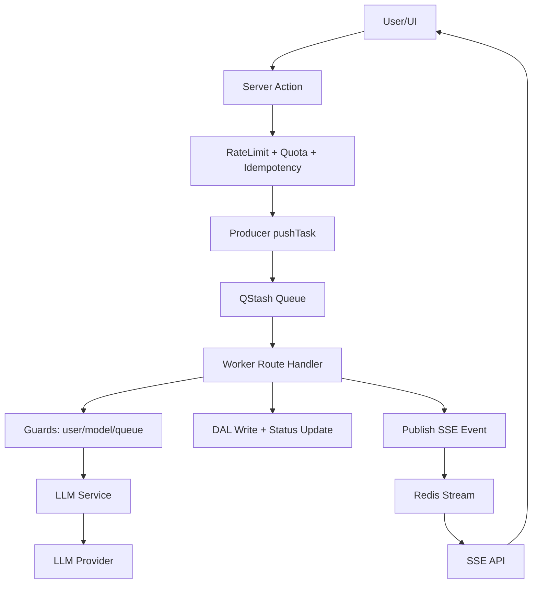

## 现状记录 & 优化点

1）模型超时机制：现状与优化空间

- **任务入口与调用链**：job_vision / ocr / summary / prematch / match / customize / interview 都会走 worker → execute → LLM service → provider 的链路（worker 调度在 [handlers.ts](file:///Users/edisonmbli/Projects/CareerShaper/lib/worker/handlers.ts#L300-L610)，实际执行在 [execute.ts](file:///Users/edisonmbli/Projects/CareerShaper/lib/worker/steps/execute.ts#L1-L52)）。
- **超时参数来源**：worker 从模板配置读取 timeoutMs 并透传（getTaskConfig → options.timeoutMs），见 [handlers.ts](file:///Users/edisonmbli/Projects/CareerShaper/lib/worker/handlers.ts#L401-L470)。
- **模型层超时实现**：
  - **Gemini Direct**：直接包裹 Promise，超时触发 Error("Gemini timeout")（见 [gemini-direct.ts](file:///Users/edisonmbli/Projects/CareerShaper/lib/llm/gemini-direct.ts#L52-L470)）。
  - **非 Gemini Direct（LangChain）**：model 构造时注入 timeoutMs（例如 runStreamingLlmTask 中 getModel 设置 timeoutMs，见 [service.ts](file:///Users/edisonmbli/Projects/CareerShaper/lib/llm/service.ts#L817-L1049)）。
- **worker 超时错误处理**：在 LLM_EXECUTE 阶段捕获异常，若命中 timeout 关键词，会发布 `retry_available`，并传入 writeResults（见 [handlers.ts](file:///Users/edisonmbli/Projects/CareerShaper/lib/worker/handlers.ts#L529-L610)）。
- **是否需要优化**：
  - **现状已具备明确超时路径**（模型层 → worker 捕获 → retry_available 事件）。
  - **已完成优化**：在 LLM service 统一映射 timeout 等错误为 FailureCode 并写入 llm_usage_logs（见 [service.ts](file:///Users/edisonmbli/Projects/CareerShaper/lib/llm/service.ts#L792-L1062)）。
    - 覆盖 Structured/Streaming/Gemini Direct/Embedding 失败路径，避免仅靠 message 文本判断。
    - 目前映射规则：timeout → MODEL_TOO_BUSY，parse/json → JSON_PARSE_FAILED（见 [service.ts](file:///Users/edisonmbli/Projects/CareerShaper/lib/llm/service.ts#L825-L844)）。

---

2）Rate limit fallback to memory：是否仅非生产生效

- **结论**：**仅非生产（或 Redis 未配置）才会走内存降级**。生产环境 Redis 失败时采取 fail-closed。
- **具体逻辑**：
  - `isProdRedisReady()` 为真才走 Upstash；否则直接走内存 Map（见 [rateLimiter.ts](file:///Users/edisonmbli/Projects/CareerShaper/lib/rateLimiter.ts#L98-L281)）。
  - 当 Redis 请求超时/异常：
    - **生产环境**：直接 `{ ok: false }`，retryAfter 使用常量（见 [rateLimiter.ts](file:///Users/edisonmbli/Projects/CareerShaper/lib/rateLimiter.ts#L107-L272) 和 [constants.ts](file:///Users/edisonmbli/Projects/CareerShaper/lib/constants.ts#L25-L77)）。
    - **非生产环境**：允许内存 fallback（mem/memDaily），便于本地开发测试。
- **内存降级实现**：`mem` / `memDaily` 两个 Map 维护计数与 resetAt（见 [rateLimiter.ts](file:///Users/edisonmbli/Projects/CareerShaper/lib/rateLimiter.ts#L13-L142)）。

---

3）Queue 背压管理：实现与优化空间（QStash Free tier）

- **现有实现**分两层：
  - **生产者侧背压**：在 enqueue 前基于 `queueId` 计数，超过上限直接拒绝并退款（见 [producer.ts](file:///Users/edisonmbli/Projects/CareerShaper/lib/queue/producer.ts#L158-L242)）。
  - **worker 侧背压**：worker 启动时 guardQueue → enterGuards → bumpPending，失败直接 429/backpressure（见 [handlers.ts](file:///Users/edisonmbli/Projects/CareerShaper/lib/worker/handlers.ts#L319-L387)，[guards.ts](file:///Users/edisonmbli/Projects/CareerShaper/lib/worker/steps/guards.ts#L37-L67)，[common.ts](file:///Users/edisonmbli/Projects/CareerShaper/lib/worker/common.ts#L168-L199)）。
- **核心计数器实现**：`bumpPending` 在 Redis 中 INCR + TTL，并在超限时 DECR 回滚；Redis 不可用则用内存 Map（见 [counter.ts](file:///Users/edisonmbli/Projects/CareerShaper/lib/redis/counter.ts#L58-L102)）。
- **QStash Free tier 下是否足够**：
  - **已经是足够可靠的第一道闸**：生产者阻断 + worker 二次校验，避免无穷排队。
  - **已完成优化**：
    - **模型/用户并发 guard 生效**：
      - user 维度：enterUserConcurrency 使用 bumpPending(key, ttl, maxActive) 计数，超过上限返回 429 + Retry-After（见 [common.ts](file:///Users/edisonmbli/Projects/CareerShaper/lib/worker/common.ts#L248-L269)）。
      - model 维度：enterModelConcurrency 基于 modelId + tier 计数，maxWorkers 由 getMaxWorkersForModel 决定，超限返回 429（见 [common.ts](file:///Users/edisonmbli/Projects/CareerShaper/lib/worker/common.ts#L213-L241) 与 [concurrency.ts](file:///Users/edisonmbli/Projects/CareerShaper/lib/config/concurrency.ts#L13-L37)）。
      - 退出释放：cleanupFinal 并行释放 model/user/queue 计数（见 [cleanup.ts](file:///Users/edisonmbli/Projects/CareerShaper/lib/worker/steps/cleanup.ts#L1-L39)）。
    - **统一 queueMaxSize 计算**：producer/worker 统一使用 queueMaxSizeFor 计算队列上限（见 [producer.ts](file:///Users/edisonmbli/Projects/CareerShaper/lib/queue/producer.ts#L176-L236) 与 [handlers.ts](file:///Users/edisonmbli/Projects/CareerShaper/lib/worker/handlers.ts#L312-L388)）。
    - **可观测性增强**：backpressure 事件中已写入 queueId / maxSize / pending / retryAfter，便于定位模型慢或系统性拥塞（见 [producer.ts](file:///Users/edisonmbli/Projects/CareerShaper/lib/queue/producer.ts#L196-L229) 与 [handlers.ts](file:///Users/edisonmbli/Projects/CareerShaper/lib/worker/handlers.ts#L338-L384)）。

## 面向未来的项目落地指南

### A. 端到端架构闭环（可复用的核心经验）

**核心目标**：在 Next.js（Vercel）上建立一条“可控成本 + 可观测 + 可降级”的 LLM 服务流水线，让后续 AI 项目可以直接复用。

**系统分工（Why & What）**

- **Next.js App Router + Server Actions**：作为入口控制面，负责鉴权、配额、幂等、速率限制与任务编排，保证请求在“入队前”就被治理（见 [service.actions.ts](file:///Users/edisonmbli/Projects/CareerShaper/lib/actions/service.actions.ts#L1-L200)）。
- **Redis（Upstash）**：承担分布式计数器与锁（并发 guard、背压、SSE 缓冲），让系统具备“多实例一致性”（见 [counter.ts](file:///Users/edisonmbli/Projects/CareerShaper/lib/redis/counter.ts#L58-L122) 与 [lock.ts](file:///Users/edisonmbli/Projects/CareerShaper/lib/redis/lock.ts#L1-L63)）。
- **QStash**：作为“异步任务总线”，把耗时 LLM 调用从用户请求中解耦，降低 Vercel 运行时超时风险（见 [producer.ts](file:///Users/edisonmbli/Projects/CareerShaper/lib/queue/producer.ts#L41-L218)）。
- **Producer → Worker**：producer 负责入队与防抖/幂等；worker 负责 guard 校验 + LLM 执行 + 落库 + 事件推送（见 [producer.ts](file:///Users/edisonmbli/Projects/CareerShaper/lib/queue/producer.ts#L41-L218) 与 [handlers.ts](file:///Users/edisonmbli/Projects/CareerShaper/lib/worker/handlers.ts#L260-L436)）。
- **LLM Service Layer**：统一模型调用、超时、重试、usage 日志与错误码映射，避免在各业务里散落实现（见 [service.ts](file:///Users/edisonmbli/Projects/CareerShaper/lib/llm/service.ts#L280-L1062)）。
- **SSE**：用户侧可感知的进度与输出流，避免“黑盒等待”；Redis Stream 作为缓冲/去重与断点恢复来源（见 [route.ts](file:///Users/edisonmbli/Projects/CareerShaper/app/api/sse-stream/route.ts#L1-L200) 与 [common.ts](file:///Users/edisonmbli/Projects/CareerShaper/lib/worker/common.ts#L278-L336)）。
- **DAL + 状态机**：对 Service/Job/Match 等状态进行集中更新，确保 UI 能稳定追踪流程（见 [services.ts](file:///Users/edisonmbli/Projects/CareerShaper/lib/dal/services.ts#L1-L478)）。

**流程图（核心闭环）**

### B. 关键机制拆解（可直接复用）

1. **入队前治理（Server Action 层）**
   - **作用**：先做 rate limit、配额、幂等、扣费，避免“无效任务”进入队列占用 QStash 并发。
   - **实现**：createServiceAction → checkOperationRateLimit / checkQuota / recordDebit → pushTask（见 [service.actions.ts](file:///Users/edisonmbli/Projects/CareerShaper/lib/actions/service.actions.ts#L95-L200)）。

2. **双层背压与并发 Guard**
   - **生产者侧背压**：入队前 bumpPending，超限直接拦截并退款（见 [producer.ts](file:///Users/edisonmbli/Projects/CareerShaper/lib/queue/producer.ts#L158-L218)）。
   - **Worker 侧 guard**：用户/模型/队列三层并发控制，超限 429 + Retry-After（见 [common.ts](file:///Users/edisonmbli/Projects/CareerShaper/lib/worker/common.ts#L168-L269) 与 [handlers.ts](file:///Users/edisonmbli/Projects/CareerShaper/lib/worker/handlers.ts#L319-L408)）。
   - **Why**：QStash Free tier 并发有限，必须避免“队列内拥堵 + Worker 长时间占用”。

3. **LLM 调用统一化**
   - **超时与错误码**：timeout → MODEL_TOO_BUSY，parse/json → JSON_PARSE_FAILED，统一写入 llm_usage_logs（见 [service.ts](file:///Users/edisonmbli/Projects/CareerShaper/lib/llm/service.ts#L792-L1062)）。
   - **双通道执行**：Gemini Direct 走原生流式，其他模型走 LangChain（见 [service.ts](file:///Users/edisonmbli/Projects/CareerShaper/lib/llm/service.ts#L846-L1009) 与 [gemini-direct.ts](file:///Users/edisonmbli/Projects/CareerShaper/lib/llm/gemini-direct.ts#L52-L470)）。

4. **SSE 可观测闭环**
   - **事件写入**：worker publishEvent 同时写 PubSub + Stream，支持断点恢复与去重（见 [common.ts](file:///Users/edisonmbli/Projects/CareerShaper/lib/worker/common.ts#L278-L336)）。
   - **事件读取**：SSE API 从 Redis Stream 拉取并持续推送（见 [route.ts](file:///Users/edisonmbli/Projects/CareerShaper/app/api/sse-stream/route.ts#L19-L200)）。

### C. 行业最佳实践对照

**符合共识**

- **队列解耦 + Worker 执行**：隔离耗时 LLM 任务，适配 Vercel 运行时限制。
- **幂等 + 速率限制**：避免重复扣费、重复任务，控制成本波动。
- **统一日志与错误码**：可观测性优先，便于故障定位与运营分析。
- **多层背压**：producer + worker 双闸门，防止无限堆积。

**可提升空间（面向下一个项目）**

- **统一“强类型事件协议”**：当前 event payload 仍是弱类型 JSON，建议引入 Zod/TypeScript schema 做前后端一致校验，避免 UI 误判状态。
- **队列容量自适应**：queueMaxSize 静态配置，建议根据实时 latency/失败率动态调节（例如基于 Redis 统计窗口）。
- **更细粒度的超时分级**：timeout 统一映射 MODEL_TOO_BUSY，未来可按 provider/phase 区分（网络超时、模型超时、流式卡死）。
- **SSE 断线恢复策略**：目前基于 Redis Stream 的 last-event-id 已具备基础能力，可进一步加入 client-side replay 窗口与 UI 状态校验。

### D. 参数控制面：是否硬编码与可运维性挑战

**结论**：核心参数**不是散落硬编码**，而是“分层集中 + 环境可配置”的组合，但仍有运维化提升空间。

**参数来源与位置**

- **LLM 超时/温度/最大 Tokens（任务级）**：集中在任务配置表 TASK_CONFIG，并由 worker 透传至 LLM 调用（见 [config.ts](file:///Users/edisonmbli/Projects/CareerShaper/lib/llm/config.ts#L1-L38) 与 [handlers.ts](file:///Users/edisonmbli/Projects/CareerShaper/lib/worker/handlers.ts#L818-L864)）。
- **并发 guard & queueMaxSize（系统级）**：统一读取 ENV 并通过 getConcurrencyConfig 暴露（见 [env.ts](file:///Users/edisonmbli/Projects/CareerShaper/lib/env.ts#L177-L214) 与 [concurrency.ts](file:///Users/edisonmbli/Projects/CareerShaper/lib/config/concurrency.ts#L1-L45)）。
- **Worker 超时/锁 TTL/Redis Stream 合并窗口（系统级）**：统一配置在 ENV（见 [env.ts](file:///Users/edisonmbli/Projects/CareerShaper/lib/env.ts#L67-L104)）。
- **Rate Limit 窗口与上限**：ENV 中统一注入，服务端 action 调用统一入口（见 [rateLimiter.ts](file:///Users/edisonmbli/Projects/CareerShaper/lib/rateLimiter.ts#L1-L120)）。

**架构师视角的优化建议（运维平衡）**

- **配置治理一致化**：将 TASK_CONFIG 与 ENV 的关键项汇总为“运行配置视图”，输出到日志/监控（避免线上排障时需要回翻代码）。
- **动态化调参**：queueMaxSize、model/user 并发建议支持“运行时调参”（例如存 Redis 或配置中心），用灰度比例逐步生效，而不是改 ENV 重启。
- **分场景超时策略**：任务级 timeoutMs 目前静态，建议按模型/队列拥塞自动收敛（如高拥塞时收紧 timeout，低拥塞时放宽）。
- **熔断与自愈**：当某个模型持续超时，自动降级到备用模型或短路任务，并标记 FailureCode 以便后续复盘。
