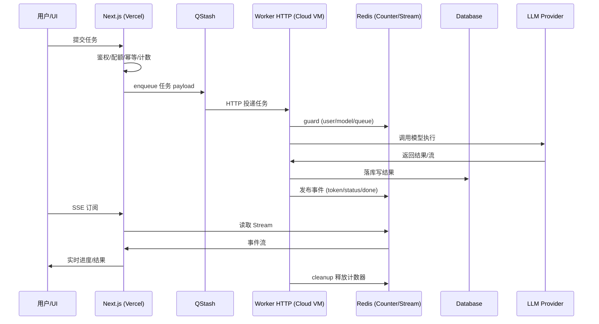
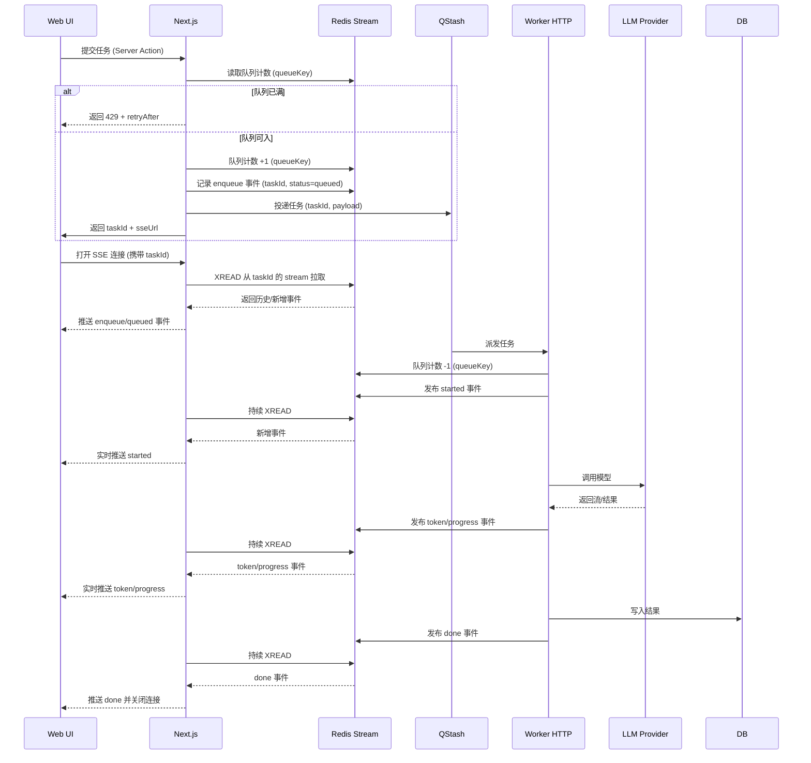
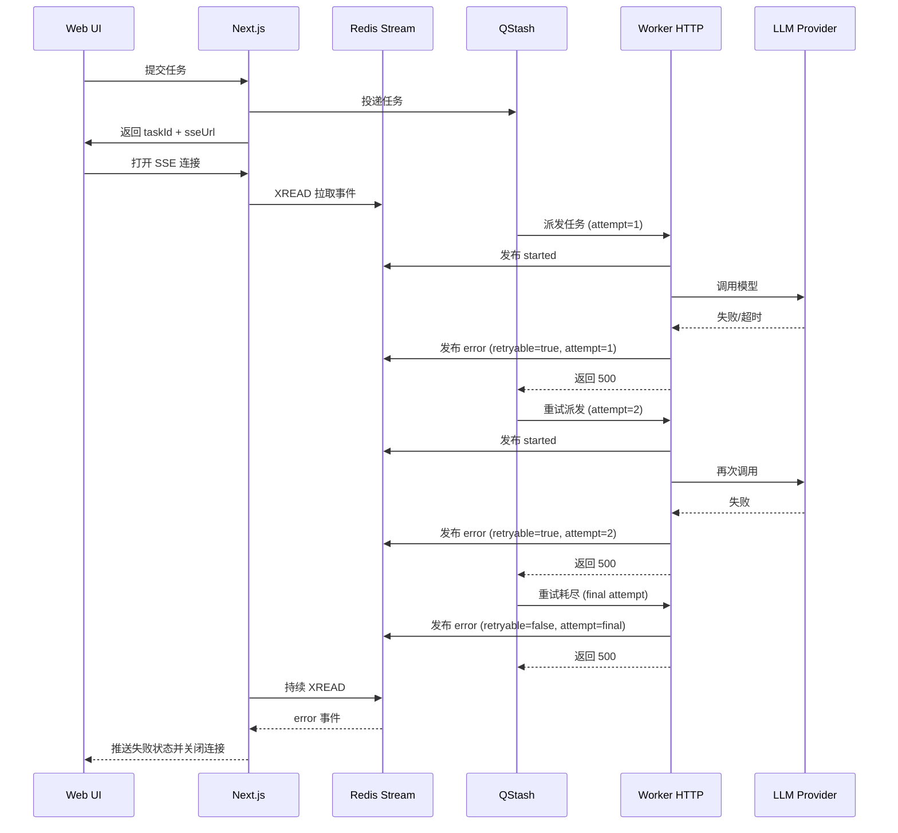
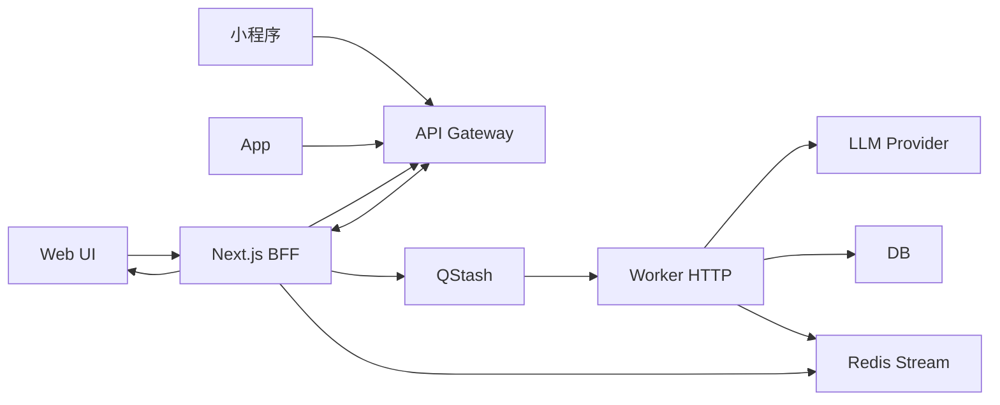

## 1.方案探索

下面展开方案 B，并结合 Vercel 的运行限制与 1～3 分钟的 LLM 调用时长，给出可行性判断。

**方案 B（QStash 只做触发，自建 Worker 池执行）的详细展开**

- **目标**：让 QStash 做“可靠投递 + 解耦入口”，把真正耗时的 LLM 执行移到可横向扩容的自建 worker 池，从而突破 QStash 并发限制和 Vercel 运行时限制。

- **总体结构**
  - **Vercel/Next.js**：入口校验、配额、幂等、任务入队（QStash 只负责将任务投递到你控制的 Worker 服务入口）。
  - **QStash**：仅负责异步投递，避免入口请求阻塞，也提供重试/延迟投递能力。
  - **自建 Worker 池**（容器或长连接服务）：真正执行 LLM 调用，写入结果、推送 SSE 事件、更新状态。
  - **状态与事件**：Redis（计数器/并发锁/Stream）、数据库（结果落库）、SSE 通道（用户实时体验）。

- **关键好处**
  - **并发弹性**：Worker 池可按实际负载水平扩容（K8s、ECS、容器平台）。
  - **时间容忍度**：LLM 调用 1～3 分钟不会触发 Vercel 运行时超时。
  - **稳定性**：队列只做投递，执行与入口解耦，失败可由 Worker 自己处理与重试策略控制。
  - **成本可控**：根据吞吐与峰值按需扩容，不必被平台并发限制卡住。

- **推荐实现路径（按落地难度排序）**
  - **B1：QStash → 自建 Worker HTTP**
    - Worker 是一个长期运行的 HTTP 服务（容器/VM）。
    - QStash 直接调用 Worker 的 URL，Worker 执行 LLM 并更新状态。
    - 优点：最少改动，最快落地。
    - 风险：Worker 本身需做鉴权、限流、幂等处理。
  - **B2：QStash → 内部队列 → Worker 进程池**
    - QStash 触发一条“轻量入队”请求，写入 Redis/BullMQ。
    - Worker 池从内部队列拉取任务执行。
    - 优点：更可控的并发与重试策略；可按优先级、模型、任务类型分队列。
    - 风险：实现复杂度上升。
  - **B3：QStash 仅用于延迟投递，主队列由你自己维护**
    - QStash 只解决“延迟、重试、定时”；主排队逻辑由内部队列处理。
    - 优点：完全掌控吞吐与调度。
    - 风险：系统复杂度最高。

- **实践建议**
  - Worker 池水平扩展目标：按峰值需求×模型耗时确定，避免排队。
  - 将 “模型调用 + 结果落库 + SSE 推送” 统一在 Worker 服务内，避免跨服务状态漂移。
  - 对慢任务建立专用队列（vision/long-context），短任务走高优先级队列。

---

**“直接在 Vercel 调用 LLM 不用 QStash”是否可行？**

- **可行但风险高，不推荐作为主路径**。
- 你当前的 LLM 调用时长：平均 1 分钟，最长 3 分钟，已经接近或超过多数 serverless 运行时的安全阈值。
- **主要风险**
  - **运行时超时**：Vercel Serverless/Edge 有严格执行时间上限，超时后请求被强行终止。
  - **长连接成本**：持续占用函数执行资源，导致并发受限、成本上升。
  - **稳定性下降**：峰值流量时延迟叠加，容易出现大面积超时。

- **什么时候可以直接调用**
  - 任务平均耗时 **小于 10～15 秒**，并且可以稳定在该范围。
  - 任务可被拆分为短步骤，并能通过流式回传持续响应（以降低超时概率）。
  - 仅作为小流量/内部工具使用。

- **在你当前情况的结论**
  - 1～3 分钟调用时长 **不适合直接在 Vercel serverless 内执行**。
  - 仍需要异步执行架构（QStash + Worker，或自建队列 + Worker）。

---

**建议的下一步**

- 如果你愿意，我可以基于“平均 60s / P95 180s 的耗时”，帮你计算：
  - 目标 SLA（例如 5 分钟内完成）下的并发需求；
  - Worker 池的最小规模；
  - 以及合理的队列上限配置建议。

只要你告诉我：峰值每分钟请求量、可接受的最长排队时间，我就能给出可落地的容量与成本估算。

## 2. B1 方案细节下钻

下面按你的 6 个问题逐条展开，用“能做架构决策”的深度回答，同时保持跟你当前项目的思路一致。

---

**1）Nextjs → QStash → Worker HTTP → LLM 的职责划分与演进**

- **是的，本质就是把 `/lib/worker` 的执行职责“迁出”成一个独立服务**。  
  现在 Next.js 既做入口（鉴权/配额/幂等/路由）又做执行（LLM 调用 + 落库 + SSE 事件），拆开后：
  - Next.js：只负责“入口治理 + 任务提交 + SSE 读取”
  - Worker HTTP：只负责“任务执行 + 结果写入 + 事件发布”

- **这样拆的直接收益**
  - **入口变薄**：移动端、小程序、APP 只需调用 Next.js 的 Server Actions（或你的 API），无需了解 LLM 执行细节。
  - **多端共享 Worker**：Worker HTTP 是“独立执行层”，只要任务协议一致，Web、小程序、APP 都能复用同一套执行能力。
  - **架构可演进**：未来你要替换队列（QStash → Kafka/Redis/BullMQ）或替换模型服务，只影响 Worker 层，不需要改前端入口。

---

**2）QStash 没有队列大小设置，队列容量应该谁控制？社区做法是什么？**

- **QStash 只负责调度与并发，队列容量控制必须由你自己做**。  
  在社区实践里，“队列容量”属于**应用层 backpressure**，通常由 Redis 计数器维护。你们项目其实已经有这套机制（bp:queue）。

- **推荐做法（成熟共识）**
  - **Producer 侧入队计数**：每次入队 +1，超过阈值直接拒绝（避免无限排队）。
  - **Worker 完成计数 -1**：任务完成后回退计数。
  - **Redis 作为统一“队列长度视图”**：前端不直接维护计数，全部由服务端负责，避免客户端伪造或网络异常导致错算。

- **结论**：  
  QStash 不负责队列大小，**你必须保留自己的队列容量控制机制**（Redis counter）。

---

**3）QStash 并发很弱，还需要它吗？是否会成瓶颈？**

- **核心结论：需要，看你把它放在哪一层**
  - 如果 QStash 直接控制 LLM 执行的并发（你现在的模式），那么确实是瓶颈。
  - **如果 QStash 只负责“触发” Worker HTTP，而 Worker HTTP 自己拥有内部任务池并发，则 QStash 并发不是最终瓶颈**。

- **保留 QStash 的理由**
  - 可靠投递、签名验证、重试、延迟调度能力。
  - 入口层请求被快速释放，不占用 Vercel 运行时。
  - 易于运维与追踪任务生命周期。

- **是否需要 Worker 内部“待办任务池”？**
  - **建议有**。  
    Worker HTTP 应该维护自己的“并发池/执行队列”，这样 QStash 只负责投递，真正的并发由你掌握。
  - 如果不使用 QStash，就必须自己实现可靠投递 + 重试 + 定时 + 幂等，对单人开发来说维护成本很高。

---

**4）Worker HTTP 用什么技术实现？Python 是否适合？**

- **主流选型**
  - **Node.js/TypeScript**：和现有代码一致，迁移成本最低。
  - **Python（FastAPI / Celery）**：非常适合做 worker，生态成熟，AI 圈常见。
  - **Go / Rust**：性能更好，但开发速度慢、生态复杂。

- **你的情况推荐**
  - **Python 是可以的，而且适合**：
    - 你已经懂 Python
    - AI 调用生态丰富（LangChain / OpenAI SDK / Pydantic）
    - 可快速搭建 Worker HTTP + 内部任务池（例如 Celery + Redis）

- **注意**
  - 如果 Worker 改成 Python，接口协议与事件模型要严谨（保持与 Next.js 协议一致）。
  - 你需要明确“数据结构”和“状态更新规范”，否则跨语言会变得难维护。

---

**5）Worker HTTP 需要多少资源？MacBook 可行吗？**

- **可行性**
  - **MVP 阶段：一台低配云服务器足够**（1vCPU/2GB）
  - **甚至本地 MacBook 常驻也可行**（仅适合自测或小流量）

- **但长期建议**
  - 用 **云服务的容器平台**（Railway, Render, Fly.io, ECS/Fargate, K8s）
  - 可以逐步扩容，且更稳定。

- **资源的核心限制**不是 CPU，而是**LLM API 的并发与网络**。  
  只要 worker 能同时发起多个请求，机器规模可以比较小。

---

**6）Worker 拆出去后，UI 进度与结果如何实时回传？**

- **核心机制仍然是 Redis Stream + SSE**，只是“发布者变了”。
  - 原来：Next.js Worker 发布事件 → Redis Stream → SSE API → 前端
  - 现在：Worker HTTP 发布事件 → Redis Stream → SSE API → 前端

- **具体链路**
  - 用户提交任务 → Next.js 入队 → QStash → Worker HTTP 执行
  - Worker HTTP 在每个阶段写入事件：`token / status / error / done`
  - Redis Stream 保存事件
  - 前端通过 SSE API 持续读取 Stream
  - UI 实时展示进度/结果

- **结论**
  - 拆出去后 **前端机制几乎不变**，只是事件发布者从 Next.js Worker 变成独立 Worker 服务。
  - 这也是为什么 Redis Stream 在你当前架构中很关键：它是“跨服务的实时通信桥”。

---

**总结：你目前最值得的演进路径**

- 保留 Next.js 作为“入口治理层”
- 保留 QStash 作为“投递与解耦层”
- 把 `/lib/worker` 逻辑迁出为 Worker HTTP
- Worker HTTP 自建并发池
- Redis Stream 继续作为“实时事件中枢”

---

如果你愿意，我可以下一步帮你画出 B1 的**完整执行时序图**，并给出“最小可用版本”拆分清单（哪些模块先迁、哪些保留），这样你就能更轻松地做架构演进决策。

## 3. MVP Worker HTTP 架构

**MVP Worker HTTP（Node.js/TypeScript）搭建方案**

- **运行形态（最小可用）**
  - 一台低配云服务器（1vCPU/2GB）+ Node.js 20。
  - 一个常驻进程（PM2 或 systemd），暴露一个 HTTP 入口用于接收 QStash 投递。
  - 依赖仍然使用你现有的 Redis/DB/LLM 服务，不新增复杂中间件。

- **Worker HTTP 的最小职责**
  - 校验 QStash 签名与 payload。
  - 读取任务数据（templateId、variables、serviceId、userId 等）。
  - 执行 guard（用户/模型/队列）与 LLM 调用。
  - 写入结果到 DB 并发布 SSE 事件（Redis Stream）。
  - 收尾：释放计数器，写入日志与耗时。

- **MVP 结构建议（Node.js/TypeScript）**
  - `server.ts`：HTTP 入口 + 路由（例如 `/worker/execute`）。
  - `task-handler.ts`：核心执行逻辑（从你现有 `/lib/worker/handlers.ts` 抽取）。
  - `llm-service.ts`：复用或迁移 `lib/llm` 中的调用逻辑。
  - `redis-pub.ts`：发布 SSE 事件与 Redis Stream 写入（复用 `publishEvent` 逻辑）。
  - `guards.ts`：复用 `lib/worker/steps/guards.ts` 的逻辑。
  - `cleanup.ts`：复用 `cleanupFinal` 的逻辑。

---

**扩容思路（你这台服务器还能扩吗？怎么扩？）**

- **第 1 阶段：单机多进程**
  - 使用 PM2 `-i max` 或 Node `cluster` 启动多进程。
  - 适合 1～2 台机器，提升并发度。

- **第 2 阶段：多机横向扩容**
  - 同一个 Worker HTTP 服务部署到多台机器。
  - QStash 仍投递到同一个域名，但通过负载均衡（Nginx/Cloudflare/LB）分发。
  - Redis/DB 仍是共享的单一来源（已经具备）。

- **第 3 阶段：自动扩容（后续）**
  - 用容器化（Docker + ECS/Fargate / K8s / Fly.io）。
  - 基于 CPU/请求量扩容，真正做到自动伸缩。

---

**B1 完整执行时序图（QStash → Worker HTTP）**



---

**“最小可用版本”拆分清单（哪些先迁，哪些先保留）**

**先迁（MVP 必须）**

- `lib/worker/handlers.ts` 核心执行逻辑
- `lib/worker/steps/*`（guards / execute / cleanup）
- `lib/llm/*`（模型调用核心）
- `lib/redis/*`（publishEvent / counter / lock）
- DB 写入相关 DAL（写入结果、状态）

**暂时保留在 Next.js**

- Server Actions（入队/鉴权/配额/幂等）
- SSE API（读取 Redis Stream）
- 前端 UI 逻辑

**原因**

- 迁出的 Worker 只需要执行与发布事件，入口和 UI 仍留在 Vercel，最小改动成本。

---

**Worker HTTP 是否还要保留在主项目中？**

建议两种方案（按维护效率排序）：

- **方案 1（推荐）**：同一仓库，但独立目录 + 独立部署
  - 例：`/apps/web` 和 `/apps/worker`
  - 共享 `lib/` 逻辑（LLM / Redis / DAL），避免重复实现。
  - 通过 monorepo（pnpm / turborepo）管理。
  - 部署：web 部署到 Vercel，worker 部署到云服务器。

- **方案 2**：完全拆成两个仓库
  - 适合大团队或未来逻辑差异很大时。
  - 但对你当前阶段会增加维护成本。

**结论**：  
MVP 阶段建议“同仓库、独立目录”，既能复用逻辑，又能独立部署，不会影响 Vercel 部署。

---

如果你愿意，我可以继续帮你输出下一层“MVP 目录结构草案 + 迁移顺序清单”，并给出“迁移当天可执行的操作步骤”，确保你能够低成本把 Worker HTTP 跑起来。

## 4. 架构细节问题下钻

下面按你提出的 4 组问题逐条“下钻剖析”，尽量把每个关键点讲透，便于你做架构决策。

---

**整体架构：多端接入与 Server Actions 是否可复用**

**1）小程序/APP 是否能复用 Server Actions？**

- **结论**：Server Actions 只能在 Next.js 的 React 体系内“直接调用”。  
  小程序/APP 不是 React Server Components 环境，**不能直接调用 Server Actions**。
- **可行复用方式**是把 Server Actions 的“业务编排逻辑”抽出来变成一个**HTTP API**：
  - Web 端：仍然走 Server Actions（内部调用相同业务函数）
  - 小程序/APP：通过 REST/GraphQL 调用 Next.js 的 API 路由（或单独 API 网关）
- **理解方式**：
  - Web 和小程序确实可以做成“很薄的客户端”
  - 但“复用的是业务编排逻辑”，不是 Server Actions 本身

**小程序的典型实现方式**

- 小程序发起请求 → Next.js API Route
- API Route 内调用和 Server Actions 同一个“服务层函数”
- 服务层函数执行：鉴权/配额/幂等/入队 → QStash → Worker
- 前端订阅进度：Web 用 SSE，小程序需要 WebSocket 或长轮询

**结论**：  
Web 与小程序的“后端编排”可以共用，但入口形式不同。Server Actions 本身只对 Web 端直接复用。

---

**队列管控：背压与并发谁来负责**

**2-1）Backpressure 需要在 Next.js 做吗？**

- **是的，需要在 Next.js 的生产者层做。**  
  QStash 不提供队列大小控制，所以“队列长度上限”必须由应用层实现。
- 标准做法：
  - Next.js 入队前 → Redis 计数器 +1
  - 超过阈值 → 拒绝入队（返回前端）
  - Worker 完成 → Redis 计数器 -1

**队列是否要按 Web/小程序拆 4 个？**

- **不必**。  
  实际推荐按“任务类型 + tier”分队列：
  - paid_stream / free_stream / paid_vision / free_vision 等
- Web 与小程序只是“入口不同”，通常**共享同一队列**，否则会把并发切得更碎。

---

**2-2）并发限制应该在哪里？**

- **真正的并发控制在 Worker 侧完成**（guard + cleanup）。  
  你当前在 `/lib/env.ts` 里的模型/用户/队列并发配置：
  - 应该迁移到 Worker 服务的环境变量中
  - Next.js 仍需保留“队列上限”的配置（用于入队前 backpressure）

**简化理解**

- Next.js：控制“入队数量”（队列大小）
- Worker：控制“执行并发”（model/user/queue 并发）

---

**2-3）Worker 满载时，任务积压怎么处理？**

- **推荐机制**
  - 入队前通过 Next.js backpressure 控制队列长度
  - Worker guard 如果拒绝，返回“繁忙”错误
  - QStash 负责重试（可设置重试次数与延迟）
  - 重试失败 → 标记任务失败并通知前端

**是否需要 Worker 内部任务池？**

- **如果保留 QStash，就不必须。**  
  因为 QStash 本身已经是“队列 + 调度器”。
- 只有在你想“绕过 QStash 并发瓶颈”时，才需要 Worker 内部任务池。

---

**对 Worker HTTP 的担忧**

**3-1）没有 Next.js 支撑会很复杂吗？**

- **不复杂。**  
  Worker HTTP 本质是一个“执行服务”，你可以用很轻量的框架：
  - **Fastify / Express**（Node.js）
  - 只要能处理 HTTP 请求 + 调用 LLM + 写 Redis/DB 即可
- 社区常见的组合：
  - Fastify + pino（日志）
  - Zod（payload 校验）
  - BullMQ/Redis（可选队列）
  - Upstash SDK（验证 QStash 签名）

**工作量概览**

- 1 个 HTTP 路由
- 1 套任务执行函数
- 2～3 个基础模块（guards / publishEvent / cleanup）
- 复用你现有的 LLM & DAL 逻辑

---

**3-2）1vCPU/2GB 的并发能力估算**

- 你的 LLM 调用是 I/O 密集型，CPU 压力不大。
- 理论上**可同时挂起多个请求**，但要注意：
  - 每个并发连接会占用内存
  - LLM provider 也有并发上限
- **保守估计**
  - 1vCPU/2GB 的单机：稳定并发 5～15 是合理的
  - 如果 LLM 调用平均 60～180 秒，吞吐≈ 5～15 / 分钟
- 但这只是 MVP 级别，后续必须水平扩容

---

**3-3）Worker 部署位置是否需要靠近 Vercel**

- 不是必须靠近 Vercel，**更重要的是靠近 Redis/DB 和 LLM Provider**
- 因为 Worker 需要频繁访问 Redis/DB + LLM
- 推荐策略：
  - Redis/DB 在哪，就把 Worker 放哪（降低 RTT）
  - Vercel 可以全球边缘，入口延迟影响不大

---

**进度实时同步：B1 架构下的 SSE 全链路**

**4-1）更新后的 B1 时序图（Web + SSE 场景 + Backpressure）**



**4-2）Backpressure 的判断、+1、-1 规则**

- 判断：入队前读取 `queueKey` 的当前计数并与上限比较。
- +1：允许入队时立即执行队列计数 +1，并记录 enqueue 事件。
- -1：Worker 实际接到任务开始执行时，队列计数 -1（表示“离开队列进入执行”）。
- 队列长度代表“等待执行的任务数”，不包含已被 Worker 接手的执行中任务。

**4-2a）Backpressure 队列键命名规范**

- 队列枚举：`q_paid_stream` `q_free_stream` `q_paid_batch` `q_free_batch` `q_paid_vision` `q_free_vision`
- 计数器键：`bp:queue:{queueId}`
- 示例：
  - `q_paid_stream` → `bp:queue:q_paid_stream`
  - `q_free_vision` → `bp:queue:q_free_vision`

**4-2b）Backpressure 配置映射规则**

- `QUEUE_MAX_SIZE` 作为默认上限。
- 分级上限按队列维度覆盖默认值：
  - `q_paid_stream` → `QUEUE_MAX_PAID_STREAM`
  - `q_free_stream` → `QUEUE_MAX_FREE_STREAM`
  - `q_paid_batch` → `QUEUE_MAX_PAID_BATCH`
  - `q_free_batch` → `QUEUE_MAX_FREE_BATCH`
  - `q_paid_vision` → `QUEUE_MAX_PAID_VISION`
  - `q_free_vision` → `QUEUE_MAX_FREE_VISION`

**4-3）为何“入队时 SSE 还没开始”依然能同步？**

- 关键是“事件先落 Redis Stream，再由 SSE 拉取”。
- 入队事件不依赖 SSE 是否已建立，只要写入 Stream 就不会丢。
- SSE 打开后从 Stream 读取“历史 + 实时增量”，所以会补上入队事件。

**4-4）SSE 与 Redis 的真实关系**

- SSE 是 **UI 与 Next.js 之间的持续连接**，不是 UI 直连 Redis。
- Redis 只负责“事件持久化与游标读取”。
- Next.js SSE API 负责：
  - 读 Redis Stream
  - 将事件转换成 SSE 流推送给 UI

**4-5）完整流程如何确保每一步都能同步到 UI**

- 入队：Next.js 入队时写入 Stream，UI 打开 SSE 后补读。
- 派发：Worker 启动时写入 started 事件。
- 进展：Worker 按 token/progress 发布事件。
- 结果：Worker 写入 done 事件并携带结果摘要或结果引用。
- UI 只需维持 SSE 连接即可“持续接收”。

**一句话总结**

- UI 只连 Next.js，Next.js 读 Redis Stream 并推 SSE。
- Redis 负责事件持久化，保证“先写入、后订阅”也能补齐。
- Worker 只负责写事件，不直接与 UI 通讯。

---

**异常重试/失败回传（独立小节）**

**5-1）失败与重试的职责划分**

- QStash 负责“重试调度”，Worker 负责“失败判定与事件回传”。
- Worker 在失败时必须发布 `error` 事件，SSE 端收到后可显示失败态。
- 是否重试由 QStash 配置决定，Worker 只需返回非 2xx 触发重试。

**5-2）异常重试/失败回传时序图**



**5-3）失败回传的数据字段建议**

- `type`: `error`
- `taskId`: 任务标识
- `stage`: `guards` / `execute` / `write`
- `code`: `LLM_TIMEOUT` / `LLM_ERROR` / `WORKER_OVERLOADED`
- `message`: 面向用户的失败描述
- `retryable`: `true | false`
- `attempt`: 当前重试次数

---

**多端接入：详细组件图 + 进度同步协议示例 + 迁移步骤清单**

**6-1）多端接入组件图（Web/小程序/APP）**



**6-1a）API Gateway 与 Next.js BFF 的职责分工**

- API Gateway：统一鉴权、签名校验、限流、版本路由与日志审计。
- Next.js BFF：业务编排、配额/背压判断、入队、SSE 输出与 UI 适配。
- 小程序/APP 只与 API Gateway 通讯，Gateway 将请求透传到 Next.js BFF。
- Web 端直接调用 Next.js BFF 的 Server Actions 与 SSE。

**6-2）进度同步协议示例（SSE/WS 通用）**

事件类型建议：`queued` `started` `progress` `token_batch` `done` `error`

```text
event: started
data: {"type":"started","taskId":"t_123","stage":"execute","requestId":"r_1","traceId":"tr_1","timestamp":1730000000}

event: progress
data: {"type":"progress","taskId":"t_123","stage":"execute","delta":"...","requestId":"r_1","traceId":"tr_1","timestamp":1730000001}

event: done
data: {"type":"done","taskId":"t_123","stage":"write","resultRef":"db:result:987","requestId":"r_1","traceId":"tr_1","timestamp":1730000005}

event: error
data: {"type":"error","taskId":"t_123","stage":"execute","code":"LLM_TIMEOUT","message":"模型响应超时","retryable":false,"attempt":3,"requestId":"r_1","traceId":"tr_1","timestamp":1730000006}
```

**6-3）迁移步骤清单（可执行版）**

1. 抽离 Worker 入口为独立 HTTP 服务，复用现有 `lib/worker` 与 `lib/llm`。
2. 保留 Next.js Server Actions 作为入队入口，新增“队列上限 backpressure”检查与计数。
3. Worker 启动时执行队列计数 -1，并在错误时发布 `error` 事件。
4. 保留 Next.js SSE 路由作为唯一对外推送口，继续从 Redis Stream 拉取。
5. 小程序/APP 通过 API Gateway 调用同样的入队逻辑，Web 继续走 Server Actions。
6. 小程序/APP 的进度通道选择 WS 或长轮询，协议沿用同一事件结构。
7. 将并发/队列上限配置迁移到 Worker 与 Next.js 各自的环境变量中。
8. 端到端验证：入队拒绝、重试失败回传、终止事件触发 SSE 关闭。

**6-4）下一步迁移必备规划（落地清单）**

1. 接入层规划：确定 API Gateway 形态（API Route / 独立网关 / BFF 透传）。
2. 认证与签名：统一小程序/APP 的鉴权方式与签名校验。
3. 事件协议冻结：定义事件字段、错误码、终止条件与版本号。
4. 进度通道选择：Web 用 SSE，小程序/APP 定 WS 或长轮询。
5. 配置拆分：Worker 与 Next.js 各自维护环境变量与队列上限映射。
6. 观测与告警：接入请求链路追踪、错误率与重试次数告警。
7. 幂等与重试策略：明确重试次数、退避策略与幂等键生命周期。
8. 容量评估：按队列并发、平均耗时、峰值 QPS 估算 Worker 实例数。
9. 回滚预案：保留旧入口，支持灰度与快速回切。
