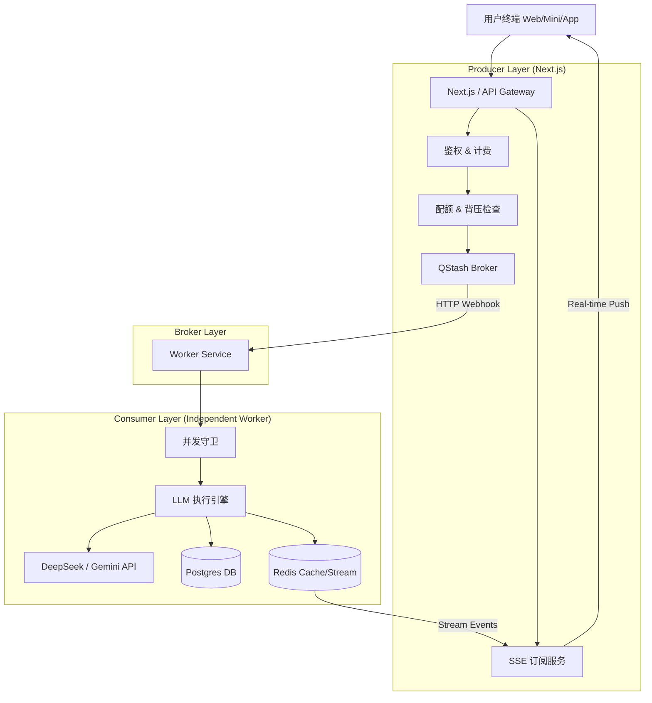

# CareerShaper 架构重构技术方案 (Technical Solution Design)

## 1. 背景与目标 (Context & Goals)

### 1.1 现状痛点

- **并发瓶颈**: 当前架构强依赖 QStash 调度 Next.js Serverless Functions，受限于 Vercel 的并发限制和 QStash 的调度能力，无法满足高并发场景。
- **扩展性差**: 逻辑耦合在 Next.js 中，难以支持多端（小程序、App）共用执行层，也难以独立扩容。
- **本地开发困难**: 缺乏完善的本地开发闭环，难以模拟生产环境的并发行为。

### 1.2 重构目标

1.  **独立执行层**: 将 Worker 逻辑剥离为独立的 Node.js HTTP 服务。
2.  **高并发支持**: 利用自建 Worker 池（Docker/VPS）替代 Serverless Function，突破 Vercel 限制。
3.  **多端复用**: 设计通用的 HTTP 接口，支持 Web、小程序、App 统一调用。
4.  **环境隔离**: 建立完善的 Local/Dev/Prod 环境隔离机制。

---

## 2. 总体架构 (Architecture Overview)

采用 **Producer-Broker-Consumer** 模式，实现入口与执行的完全解耦。



### 2.1 核心组件职责

| 组件               | 角色           | 职责                                                                                                                                | 技术栈                             |
| :----------------- | :------------- | :---------------------------------------------------------------------------------------------------------------------------------- | :--------------------------------- |
| **Next.js (Web)**  | Producer / BFF | 1. 用户鉴权 (Clerk/Custom)<br>2. 任务入队 (Enqueue)<br>3. 队列背压控制 (Backpressure)<br>4. SSE 进度推送 (Consumer of Redis Stream) | Next.js 15, React, Server Actions  |
| **QStash**         | Message Broker | 1. 异步任务调度<br>2. 失败重试 (Exponential Backoff)<br>3. 削峰填谷                                                                 | Upstash QStash                     |
| **Worker Service** | Consumer       | 1. 接收 QStash 任务<br>2. 执行 LLM 业务逻辑<br>3. 写入数据库<br>4. 发布 Redis 事件                                                  | Node.js (Hono/Fastify), TypeScript |
| **Redis**          | State Store    | 1. 任务队列计数器 (Counter)<br>2. 实时事件流 (Streams)<br>3. 分布式锁 (Redlock)                                                     | Upstash Redis / Docker Redis       |

---

## 3. 详细设计 (Detailed Design)

### 3.1 目录结构 (Monorepo)

在现有仓库中新增 `/worker` 目录，通过 `tsconfig` 共享 `/lib`。

```text
/
├── apps/
│   ├── web/ (原 Next.js 项目，保持根目录或移动) -> 建议暂时保持根目录不动，仅新增 worker 目录
├── worker/ (新增)
│   ├── src/
│   │   ├── index.ts (HTTP Server Entry)
│   │   ├── routes/ (API Routes)
│   │   └── config.ts (Env Config)
│   ├── package.json
│   ├── tsconfig.json
│   └── Dockerfile
├── lib/ (共享代码)
│   ├── llm/ (LLM 调用封装)
│   ├── redis/ (Redis 客户端 & Stream 逻辑)
│   ├── dal/ (数据库访问层)
│   └── types/ (共享类型定义)
├── prisma/ (数据库 Schema)
└── package.json (Root)
```

### 3.2 接口协议 (Interface Protocol)

**Worker 暴露的 HTTP 接口**:

- **POST** `/api/execute/stream`: 处理流式任务
- **POST** `/api/execute/batch`: 处理批处理任务

**鉴权机制**:
Worker 服务必须验证请求来源是 QStash。

- 利用 `@upstash/qstash` 的 `Receiver.verify` 方法验证签名。
- 本地开发模式下可跳过签名验证 (根据 `NODE_ENV` 或 `QSTASH_SKIP_VERIFY`)。

### 3.3 数据流转 (Data Flow)

1.  **任务提交**: 用户 -> Next.js (Server Action) -> 校验 -> QStash Enqueue。
2.  **任务分发**: QStash -> Worker Service (Webhook)。
3.  **任务执行**: Worker 收到请求 -> 解析 Payload -> 调用 `lib/worker` 逻辑 -> 执行 LLM。
4.  **状态同步**: Worker -> Redis Stream (写入 events) -> Next.js SSE Endpoint -> 用户前端。

#### 3.3.1 Payload 设计原则 (ID 为主，必要时内联)

- **默认策略**：QStash Payload 以 `taskId/serviceId/jobId` 等 ID 为主，Worker 通过 DAL 从数据库取回所需上下文。
- **内联场景**：体积小且不易再构建的输入可内联（例如短文本、压缩后的 Base64 小图）。
- **避免超限**：严格控制 Payload 体积，保证在 QStash Free Tier 的 1MB 限制内完成投递。
- **Worker 依赖**：独立 Worker 需具备数据库访问能力，必须配置 `DATABASE_URL`。

#### 3.3.2 MVP 图片传递策略 (方案一：客户端压缩 + Base64 直传)

1. **客户端判断大小**：原图 ≤ 600KB 时直接转 Base64。
2. **超过阈值先压缩**：压缩后再转 Base64。
3. **压缩仍超限则拦截**：提示用户上传 ≤ 1MB 的截图后重试。
4. **QStash 负载目标**：Base64 控制在 ~800KB 以内，留出元数据空间。
5. **Worker 侧消费**：收到 Base64 直接调用视觉模型，不依赖外部存储。
6. **扩展路径**：若后续出现高分辨率 OCR 场景，可切换到“对象存储 + URL 引用”方案。

### 3.4 环境隔离 (Environment Isolation)

通过环境变量区分不同环境的配置：

| 变量名            | Local (开发)                           | Production (线上)               |
| :---------------- | :------------------------------------- | :------------------------------ |
| `NODE_ENV`        | `development`                          | `production`                    |
| `QSTASH_URL`      | `http://localhost:8080` (QStash Local) | `https://qstash.upstash.io`     |
| `QSTASH_TOKEN`    | `mock_token`                           | `ey...` (真实 Token)            |
| `REDIS_URL`       | `redis://localhost:6379`               | `upstash://...`                 |
| `WORKER_BASE_URL` | `http://host.docker.internal:8080`     | `https://worker.yourdomain.com` |
| `DATABASE_URL`    | `postgresql://...`                     | `postgresql://...`              |

---

## 4. 扩容策略 (Scaling Strategy)

### 4.1 0 -> 1 (MVP)

- **配置**: 单台 VPS (1-2 vCPU, 2-4GB RAM)。
- **部署**: Docker Compose 运行 Worker + Caddy (反向代理)。
- **能力**: 支撑 10-50 并发 (取决于 LLM 响应速度)。

### 4.2 1 -> 10 (Growth)

- **配置**: 垂直升级 VPS (4-8 vCPU) 或增加 VPS 节点。
- **部署**: 在多台 VPS 上部署 Worker，前置 Load Balancer (Nginx/Cloudflare)。
- **能力**: 支撑 100-500 并发。

### 4.3 10 -> 100 (Scale)

- **配置**: 容器编排 (K8s / AWS ECS)。
- **部署**: 自动扩缩容 (HPA)，根据 CPU/内存或队列深度自动增加 Pod。
- **能力**: 理论无限，仅受限于数据库和外部 API 限制。

---

## 5. 安全性考虑 (Security)

1.  **API 签名**: 强制校验 QStash 签名，拒绝非 QStash 流量。
2.  **API Key 保护**: 敏感 Key (OpenAI/DeepSeek) 仅存储在 Worker 环境变量，不暴露给前端或 Producer。
3.  **DDos 防护**: 依赖 Cloudflare 或 QStash 的限流机制保护 Worker 入口。

## 6. 结论

本方案通过解耦执行层，彻底解决了并发限制问题，同时保持了代码库的统一性 (Monorepo)，为未来的多端扩展和大规模扩容奠定了坚实基础。
