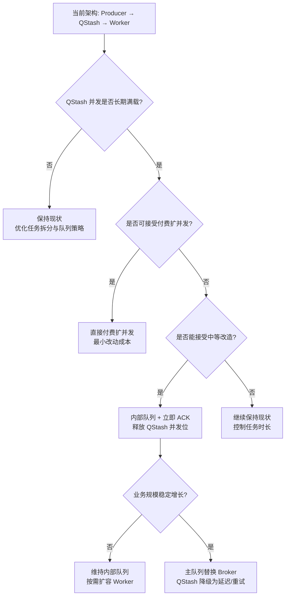

## 现状分析

**结论先行**

- 你的“灵魂扣问”是对的：在当前形态下，QStash 仍然是吞吐瓶颈，因为它要等 Worker 返回 200 才释放并发位。
- 但这次重构并不是无效，它带来了**稳定性、可扩展性、可运维性**的系统性增益，并把“吞吐瓶颈”清晰地集中到了 QStash 这一层，利于后续演进与替换。
- 换句话说：**瓶颈没有消失，但瓶颈被“隔离和管理”了**，这对健康度是实质提升。

---

**为什么 QStash 仍是瓶颈（你说得没错）**

- QStash 的并发位释放条件是 Worker 回 200，任务耗时越长，并发位占用越久。
- 你现在用 Hono 代替 Next.js，并没有改变这一“回 200 才释放并发”的事实。
- 因此，**QStash Free Tier 的 10 并发仍然是硬上限**。这点在架构文档里也有反复强调（见 [01_Architecture_Design.md](file:///Users/edisonmbli/Projects/CareerShaper/docs/refactor/01_Architecture_Design.md)）。

---

**这次重构带来的真实增益（不是吞吐，但很关键）**

1. **从“架构耦合”变成“职责分离”**
   - Next.js 不再承担长时 LLM 任务，避免了 Serverless 超时、冷启动、内存限制、SSE 被阻断等典型问题。
   - Worker 有独立生命周期、资源池、日志和错误隔离能力（见 [worker/index.ts](file:///Users/edisonmbli/Projects/CareerShaper/worker/src/index.ts)）。

2. **系统稳定性提升**
   - Worker 崩溃不会拖死 Next.js Web 服务。
   - 更清晰的“入口层” vs “执行层”分工，减少线上故障时的影响范围。

3. **弹性与扩容路径被打开**
   - 你现在可以在 VPS 上水平扩 Worker 副本，哪怕 QStash 并发上限暂时不变，**Worker 本身的执行瓶颈已经解除**。
   - 这为后续“减少单任务耗时”或“切换 Broker”提供基础（见 [03_Worker_Setup_Guide.md](file:///Users/edisonmbli/Projects/CareerShaper/docs/refactor/03_Worker_Setup_Guide.md)）。

4. **调度策略更清晰**
   - 任务路由、队列策略、背压等逻辑不再与 Next.js 请求生命周期混在一起，治理能力提升。

---

**那“吞吐提升”到底来自哪里？**
目前提升来源不是“吞吐上限”，而是：

- **减少单任务失败概率**（Worker 独立部署、避免 Vercel 超时、减少请求中断）
- **减少任务平均耗时**（Worker 可用更高性能 VPS / 更稳定网络）
- **使“后续替换 Broker”成为可行路线**（比如从 QStash 迁移到自建队列或 Kafka/Redis Stream）

所以它是**为吞吐提升创造条件**，但不是立即把吞吐上限提升。

---

**如果你希望真正突破 QStash 并发瓶颈，有三种方向**

1. **升级 QStash 付费并发（最省事）**
   - 直接扩并发，短期最省开发成本。

2. **用“内部队列 + 立即 ACK”模式**
   - Worker 收到请求立即返回 200。
   - 真正的任务进入 Redis / DB / 内部队列异步执行。
   - 这样 QStash 并发位被快速释放，吞吐可突破。

3. **彻底替换 Broker**
   - QStash 只保留为延迟/重试/调度器，主队列交给内部系统。
   - 或直接使用 Kafka / RabbitMQ / Redis Stream。

---

**最终判断：这次重构“健康吗，有实际提升吗？”**

- **健康**：是的，属于架构卫生和解耦的重要升级。
- **实际提升**：有，但主要体现在**稳定性、可靠性、可扩展性**，而非“吞吐上限”。
- **吞吐上限**：仍受 QStash Free Tier 限制，这一点在逻辑上确实没有改变。

---

## 吞吐瓶颈突破方案对比清单

| 方案                                          | 本质做法                         | 吞吐提升效果   | 实施复杂度 | 成本模型       | 适用阶段        |
| --------------------------------------------- | -------------------------------- | -------------- | ---------- | -------------- | --------------- |
| 付费 QStash 扩并发                            | 直接提升 QStash 并发位           | 立竿见影       | 低         | 按量付费       | 起步期 → 成长期 |
| Worker 内部队列 + 立即 ACK                    | 收到请求先回 200，再内部异步执行 | 明显提升       | 中         | 主要是开发成本 | 成长期          |
| Broker 替换 (Redis Stream / RabbitMQ / Kafka) | 自建队列系统替代 QStash          | 最大化可控吞吐 | 高         | 运维成本显著   | 成熟期          |

## 实际落地建议

**A. 起步阶段（QStash Free Tier 可接受）**

- 当前架构属于主流实践：Producer（Next.js）→ Broker（QStash）→ Consumer（Hono Worker），符合社区常见的异步解耦模式。
- 风险控制重点不在吞吐，而在可靠性：签名校验、重试、幂等、背压与队列隔离已具备基础能力。
- 结论：方向正确，不会为后续扩容埋结构性大坑。

**B. 成长期（QStash 成为明确瓶颈）**

- 低成本路径：直接付费扩并发，成本换时间，最快解除阻塞。
- 中成本路径：引入 “Worker 内部队列 + 立即 ACK” 机制，显著提升有效吞吐，降低 QStash 并发位占用时长。
- 推荐先做“内部队列”试点，仅对最慢的 Heavy 任务使用，效果最明显。

**C. 成熟期（高并发 + 成本敏感）**

- 逐步替换 Broker：把 QStash 定位为延迟/重试调度器，主队列迁移到 Redis Stream / RabbitMQ。
- 需要配套：监控、失败重试、DLQ、回放能力与运维值守流程。

**D. 何时升级的量化信号**

- QStash 队列长期满载（并发位占用时间高、排队时间显著上升）。
- 业务峰值时任务“入队失败”或“重试次数升高”。
- Worker CPU/内存仍有余量，但队列侧卡住吞吐。

---

## 阶段性决策树图

## 成本区间估算 (相对级别 + 可量化输入)

**1. 付费 QStash 扩并发**

- **成本构成**：并发档位 + 请求量/投递量。
- **现金成本**：低 → 中（随并发位阶梯式上升）。
- **开发成本**：极低（配置级别变更）。
- **估算方式**：请求量 × 平均任务时长 → 推算需要的并发位，再对应 QStash 套餐档位。

**2. Worker 内部队列 + 立即 ACK**

- **成本构成**：一次性开发 + Redis/数据库持久化 + 运维。
- **现金成本**：低 → 中（取决于 Redis 规格与存储策略）。
- **开发成本**：中（人日级到人周级）。
- **估算方式**：任务峰值 TPS × 排队时长 × 任务体积 → 估算队列存储与回放容量。

**3. Broker 替换 (Redis Stream / RabbitMQ / Kafka)**

- **成本构成**：自建队列 + 监控运维 + 可用性保障。
- **现金成本**：中 → 高（取决于高可用与多副本需求）。
- **开发成本**：高（人周级到人月级）。
- **估算方式**：峰值 TPS + 延迟要求 + 数据保留天数 → 估算集群规模与运维复杂度。

## 其它关键前置经验 (为后续扩容打基础)

**A. 先控制“任务时长分布”**

- 吞吐瓶颈的本质是“并发位占用时长”，先压缩最慢的 10% 任务时长，收益远大于纯扩并发。
- 把任务拆成“短链 + 可恢复步骤”，减少单次 200 的等待时间。

**B. 先把监控可视化做成最低成本闭环**

- 关键指标最少三条：队列等待时间、QStash 并发位占用率、Worker 执行耗时分布。
- 有了曲线，才知道应该“扩并发”还是“改流程”。

## 监控体系搭建：当前架构 vs 内部队列

**A. 当前架构（Producer → QStash → Worker）**

- **队列等待时间（Queue Wait Time）**：
  - 记录入队时间 `enqueuedAt`，Worker 处理时打点 `startedAt`。
  - 等待时间 = `startedAt - enqueuedAt`，按队列维度聚合。
- **QStash 并发位占用率**：
  - 观察 QStash 队列的实时并发与排队长度。
  - 若可用，结合 QStash 控制台或 API 指标做趋势图。
- **Worker 执行耗时分布**：
  - 记录 `startedAt / finishedAt`，分任务类型/模型维度统计 P50/P90/P99。
  - 结合错误率与超时率，定位慢任务或不稳定模型。
- **最低成本落地方式**：
  - 以日志为主，埋点输出到 JSON Log。
  - 每天跑一次轻量脚本汇总，先得到趋势再决定是否上专业监控。

**B. 迁移到内部队列后（QStash 仅负责投递/重试）**

- **队列等待时间（Internal Queue Lag）**：
  - 内部队列入队打点 `internalEnqueuedAt`，Worker 真正开始执行时打点 `internalStartedAt`。
  - 这是新的关键瓶颈指标，应按优先级/队列类型拆分。
- **QStash 并发位占用率**：
  - 关注点降低，主要看 “入队失败” 与 “重试次数”。
  - 若这些指标异常升高，说明上游仍有瓶颈或 ACK 机制不稳定。
- **Worker 执行耗时分布**：
  - 仍是核心指标，但需要区分：排队延迟 vs 执行耗时。
  - 否则容易误判（排队时间被算进执行耗时）。
- **最低成本落地方式**：
  - 内部队列的状态建议落 Redis 或 DB，用定时任务导出统计。
  - 先做“可追踪的三条曲线”，再逐步引入报警与分布式追踪。

**C. 可直接复用的观测字段建议**

- `enqueuedAt / startedAt / finishedAt`
- `queueId / taskId / modelId / tier`
- `retryCount / errorCode / timeoutFlag`
- `workerInstanceId`（用于定位单机异常）

**C. 先确定不可变协议**

- QStash → Worker 的 payload 应保持向后兼容，避免未来替换 Broker 时的迁移成本。
- 统一任务状态机与事件编码，避免扩容时出现“口径不一致”的调试灾难。

**D. 先构建可撤销的演进路径**

- 每次优化尽量可回滚：内部队列先只试点 Heavy 任务。
- Broker 替换可以并行跑一段时间，通过灰度切流逐步迁移。
